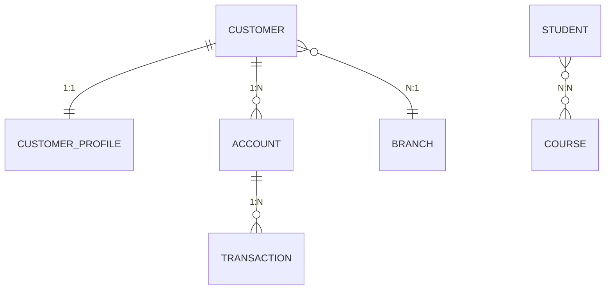
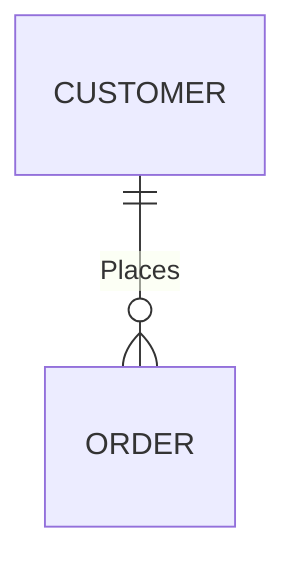
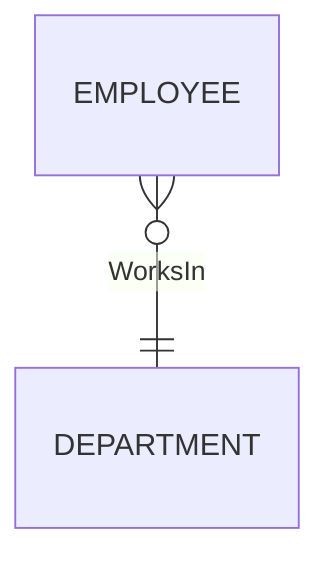
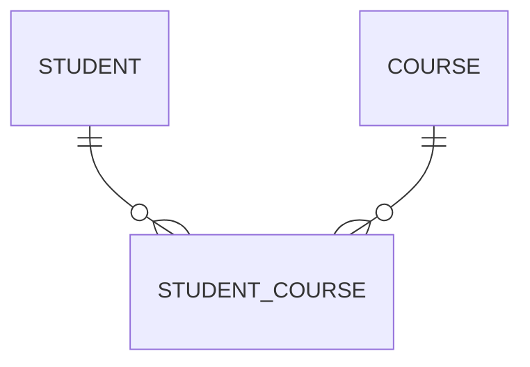

# Database Relationships Explained in Detail

> One of the most common mistakes developers make is choosing the wrong relationship between tables.
>
> A poor relationship design leads to:
>
> - Duplicate data
> - Slow queries
> - Difficult maintenance
> - Update anomalies
> - Delete anomalies
> - Complex joins
> - Poor scalability

This guide explains **when to use**:

- One-to-One (1:1)
- One-to-Many (1:N)
- Many-to-One (N:1)
- Many-to-Many (N:N)

along with real-world examples, SQL Server implementation, performance implications, and production best practices.

---

# Understanding Relationships

Imagine you're designing a banking application.

You have:

- Customers
- Accounts
- Transactions
- Cards
- Branches

Each entity has a relationship with another.

The relationship determines:

- Data integrity
- Query performance
- Storage
- Scalability

---

# Visual Overview



---

# Relationship Types

| Relationship | Meaning |
|------------|-----------|
| 1 : 1 | One record relates to exactly one record |
| 1 : Many | One parent has many children |
| Many : 1 | Many records belong to one parent |
| Many : Many | Many records relate to many records |

---

# 1. One-to-One (1:1)

## Definition

One row in Table A matches **exactly one** row in Table B.

```
Person
-------
1

Passport
---------
1
```

Person 1 → Passport 1

Passport belongs to only one person.

---

## Real World Examples

### Banking

```
Customer
↓

Customer KYC
```

Each customer has only one KYC record.

---

### Healthcare

```
Patient
↓

Medical History
```

One patient

↓

One permanent history

---

### Employee

```
Employee

↓

Employee Locker
```

Each employee has one assigned locker.

---

# SQL Example

```sql
CREATE TABLE Customer
(
    CustomerId INT PRIMARY KEY,
    Name VARCHAR(100)
);

CREATE TABLE CustomerProfile
(
    CustomerId INT PRIMARY KEY,
    Address VARCHAR(200),
    FOREIGN KEY(CustomerId)
    REFERENCES Customer(CustomerId)
);
```

Notice

CustomerId is both

- Primary Key
- Foreign Key

This guarantees one profile per customer.

---

# Why Use 1:1?

Usually to separate data.

Example

Customer

```
Id
Name
DOB
```

Sensitive data

```
PAN
AADHAR
Salary
Passport
```

Not every query needs sensitive information.

Instead of loading everything

Split into

```
Customer

CustomerSecurity

CustomerTax

CustomerMedical
```

---

# Advantages

✅ Better security

✅ Smaller tables

✅ Faster queries

✅ Easier maintenance

---

# Disadvantages

Requires JOIN.

---

# Best Practice

Use 1:1 only when

- Optional information
- Security
- Large columns
- Different lifecycle

Do NOT split tables unnecessarily.

---

# 2. One-to-Many (1:N)

Most common relationship.

One parent

↓

Many children

---

Example

Customer

```
CustomerId
```

Orders

```
Order1

Order2

Order3
```

One customer

↓

Many orders

---

Mermaid



---

# Banking Example

```
Customer

↓

Accounts
```

One customer

↓

Savings

↓

Current

↓

Loan

---

# E-commerce

```
Order

↓

Order Items
```

One order

↓

Laptop

↓

Mouse

↓

Keyboard

---

# SQL

```sql
CREATE TABLE Customer
(
    CustomerId INT PRIMARY KEY
);

CREATE TABLE Orders
(
    OrderId INT PRIMARY KEY,

    CustomerId INT,

    FOREIGN KEY(CustomerId)
    REFERENCES Customer(CustomerId)
);
```

---

# Why?

Without this

Imagine storing

```
Customer

Orders

Order1

Order2

Order3
```

inside one column.

Impossible to query efficiently.

---

# Advantages

Most natural relationship.

Very scalable.

Simple.

Normalized.

---

# Performance

Excellent.

Index

```
CustomerId
```

on child table.

---

# Best Practice

Always index Foreign Keys.

```sql
CREATE INDEX IX_Orders_CustomerId
ON Orders(CustomerId);
```

---

# 3. Many-to-One (N:1)

This is simply the reverse view of One-to-Many.

Example

Looking from Order side

```
Order

↓

Customer
```

Many orders

↓

One customer

---

Example

```
Employee

↓

Department
```

100 employees

↓

IT Department

---

Mermaid



---

SQL

```sql
Employee

EmployeeId

DepartmentId
```

Department

```
DepartmentId
```

Every employee stores

DepartmentId

---

# Best Practice

Think

Many children

store

One parent's key.

---

# 4. Many-to-Many (N:N)

Most misunderstood relationship.

---

Example

Student

↓

Courses

Student A

```
Math

Physics
```

Student B

```
Physics

Chemistry
```

One student

Many courses

One course

Many students

---

Cannot store directly.

Need

Junction Table.

---

Mermaid



---

# SQL

Student

```sql
Student
(
StudentId
)
```

Course

```sql
Course
(
CourseId
)
```

Bridge

```sql
CREATE TABLE StudentCourse
(
StudentId INT,

CourseId INT,

PRIMARY KEY
(
StudentId,
CourseId
),

FOREIGN KEY(StudentId)
REFERENCES Student(StudentId),

FOREIGN KEY(CourseId)
REFERENCES Course(CourseId)
);
```

---

# Why Junction Table?

Without it

```
Student

Courses

1,3,5,8
```

inside one column.

Impossible to

- Index
- Join
- Search

Violates normalization.

---

# Real World Examples

## Banking

```
Customer

↓

Products
```

Customer owns

- Credit Card
- Loan
- FD

Product

↓

Many customers

---

Need

CustomerProduct

---

## E-commerce

```
Products

Categories
```

Laptop

↓

Electronics

↓

Computers

↓

Offers

Many

Many

---

Need

ProductCategory

---

## Social Media

```
Users

↓

Groups
```

Many users

Many groups

---

Need

UserGroup

---

# Performance

Always index

```
(StudentId, CourseId)

(CourseId, StudentId)
```

depending upon queries.

---

# Internal Working

Database never stores

Many-to-Many directly.

It becomes

```
Student

Course

StudentCourse
```

Internally.

---

# Normalization Perspective

| Normal Form | Relationship Impact |
|-------------|---------------------|
| 1NF | No repeated values in columns |
| 2NF | Separate repeating groups |
| 3NF | Remove transitive dependencies |
| BCNF | Stronger key dependency rules |

Many-to-Many almost always requires a bridge table to satisfy normalization.

---

# Which Relationship Should You Choose?

| Scenario | Relationship |
|----------|--------------|
| Customer → Orders | 1:N |
| Order → Customer | N:1 |
| Employee → Locker | 1:1 |
| Student → Course | N:N |
| User → Roles | N:N |
| Company → Departments | 1:N |
| Branch → Employees | 1:N |
| Product → Inventory Transactions | 1:N |
| Doctor → Patients | N:N |
| Customer → Address (if only one permanent address) | 1:1 |

---

# Production Examples

## Amazon

```
Customer

↓

Orders
```

1:N

---

```
Order

↓

OrderItems
```

1:N

---

```
Products

↓

Categories
```

N:N

---

```
Customer

↓

Wishlist

↓

Products
```

N:N

---

## Banking (UBS-style)

```
Customer

↓

Accounts
```

1:N

```
Account

↓

Transactions
```

1:N

```
Employee

↓

Department
```

N:1

```
Customer

↓

KYC
```

1:1

```
Customer

↓

Financial Products
```

N:N

---

# Performance Considerations

| Relationship | Query Performance | Storage | Joins | Typical Index |
|--------------|------------------|----------|-------|---------------|
| 1:1 | Very Fast | Low | One JOIN | PK/FK |
| 1:N | Fast | Low | One JOIN | FK on child |
| N:1 | Fast | Low | One JOIN | FK on child |
| N:N | Moderate | Medium | Two JOINs | Composite PK + supporting indexes |

---

# Best Practices

## 1. Always Enforce Foreign Keys

Foreign keys maintain referential integrity, preventing orphan records.

```sql
FOREIGN KEY(CustomerId)
REFERENCES Customer(CustomerId)
```

---

## 2. Index Foreign Keys

Foreign keys are frequently used in joins.

```sql
CREATE INDEX IX_Orders_CustomerId
ON Orders(CustomerId);
```

---

## 3. Avoid Comma-Separated Values

❌ Bad

```text
CourseIds = '1,2,3'
```

✅ Good

```text
StudentCourse
```

---

## 4. Use Composite Keys for Bridge Tables

```sql
PRIMARY KEY(StudentId, CourseId)
```

This prevents duplicate relationships.

---

## 5. Add Attributes to Bridge Tables When Needed

Many bridge tables represent more than just a relationship.

Example:

```text
OrderProduct

OrderId
ProductId
Quantity
UnitPrice
Discount
AddedOn
```

The bridge becomes an entity in its own right.

---

## 6. Consider Cascading Carefully

Use `ON DELETE CASCADE` only when deleting the parent should always delete children (for example, `Order` → `OrderItems`).

Avoid cascades for critical business entities (such as `Customer` → `Transactions`) where historical data must be preserved.

---

# Common Mistakes

- Storing multiple IDs in one column (comma-separated values).
- Forgetting indexes on foreign keys.
- Creating unnecessary 1:1 tables, leading to excessive joins.
- Modeling N:N relationships without a bridge table.
- Using natural keys that change frequently instead of stable surrogate keys.
- Missing unique constraints where business rules require uniqueness.

---

# Debugging Relationship Issues

## SQL Server Tools

Enable execution statistics:

```sql
SET STATISTICS IO ON;
SET STATISTICS TIME ON;
```

View the **Actual Execution Plan** (`Ctrl + M` in SQL Server Management Studio).

Look for:

- Table Scans
- Clustered Index Scans
- Key Lookups
- Hash Matches
- Missing Index recommendations

Useful system views:

```sql
-- Find foreign keys
SELECT *
FROM sys.foreign_keys;

-- Find indexes
SELECT *
FROM sys.indexes;
```

---

# Easy Analogy

Imagine a **library**:

- **1:1** → One library card belongs to one member.
- **1:N** → One author writes many books.
- **N:1** → Many books are published by one publisher.
- **N:N** → Many readers borrow many books over time (tracked by a `BorrowHistory` table).

The `BorrowHistory` table is the **junction (bridge) table**, recording which reader borrowed which book and when.

---

# Interview Questions

## Beginner (5)

1. What is a foreign key?
2. What is the difference between a primary key and a foreign key?
3. Explain a One-to-Many relationship with an example.
4. Why can't a Many-to-Many relationship be implemented directly?
5. What is referential integrity?

---

## Intermediate (5)

1. Why should foreign keys be indexed?
2. How would you model Products and Categories?
3. What is a junction table?
4. When would you use a One-to-One relationship?
5. How do foreign keys affect delete operations?

---

## Senior (10)

1. When would you denormalize a relationship for performance?
2. How would you model versioned relationships (e.g., employee department history)?
3. How do you prevent duplicate entries in a Many-to-Many bridge table?
4. What are the trade-offs between surrogate keys and composite keys?
5. How do cascading deletes affect large tables?
6. How do you optimize joins on large child tables?
7. How would partitioning affect parent-child relationships?
8. How do you migrate an existing schema from 1:N to N:N?
9. What are the locking implications of large cascading deletes?
10. How do you enforce business rules that span multiple related tables?

---

# Interview Questions (10+ Years Experience)

## 1. How does SQL Server enforce referential integrity internally?

**Why Interviewers Ask It**

To test understanding of storage engine behavior.

**Expected Answer**

SQL Server validates the existence of the referenced parent key before allowing inserts or updates to child rows. During deletes or updates on parent rows, it checks referencing rows and enforces configured actions (`NO ACTION`, `CASCADE`, `SET NULL`, etc.).

**Common Wrong Answer**

"Foreign keys are just documentation."

**Follow-up Questions**

- Does SQL Server automatically create indexes on foreign keys?
- How do foreign keys impact insert performance?

**Ideal Senior-Level Response**

Foreign keys improve data integrity but introduce validation overhead on writes. Indexing foreign keys is critical to avoid table scans during parent updates or deletes.

**Production Example**

In a banking system, a transaction cannot reference a non-existent account.

---

## 2. When would you intentionally avoid a foreign key?

- High-volume ETL loads where validation is performed externally.
- Cross-database or cross-service architectures.
- Event-sourced systems where eventual consistency is acceptable.

Always weigh integrity against throughput.

---

## 3. How do you optimize a Many-to-Many table with billions of rows?

**Ideal Response**

- Composite clustered key.
- Additional nonclustered indexes for reverse lookups.
- Partitioning.
- Compression.
- Filtered indexes if applicable.
- Archive historical relationships.

---

## 4. How do relationships influence lock contention?

Parent updates or deletes may lock child rows during constraint checks. Proper indexing reduces lock duration and minimizes blocking.

---

## 5. Explain the trade-offs between normalization and denormalization.

Normalized schemas reduce redundancy and improve consistency. Denormalization reduces joins and improves read performance at the cost of additional write complexity and potential data inconsistency.

---

## 6. How would you model historical relationships?

Use effective date ranges:

```text
EmployeeDepartmentHistory
-------------------------
EmployeeId
DepartmentId
EffectiveFrom
EffectiveTo
```

Never overwrite historical assignments.

---

## 7. How do bridge tables evolve into business entities?

A bridge table often starts as a pure relationship table but later gains business attributes (e.g., quantity, price, enrollment date). At that point, it becomes a full-fledged entity.

---

## 8. How do foreign keys affect distributed microservices?

Avoid database-level foreign keys across service boundaries. Enforce consistency through APIs, domain events, sagas, or outbox patterns.

---

## 9. What indexing strategy would you use for parent-child tables?

- Clustered PK on parent.
- Nonclustered index on child FK.
- Covering indexes for common queries.
- Composite indexes based on filtering and sorting patterns.

---

## 10. How would you identify relationship bottlenecks in production?

- Analyze execution plans.
- Use `SET STATISTICS IO/TIME`.
- Monitor wait statistics (`LCK_*` waits).
- Review missing index DMVs.
- Use Query Store.
- Capture deadlocks with Extended Events.
- Monitor Azure SQL Intelligent Insights (if applicable).

---

# Key Takeaways

- **1:1** → Split optional or sensitive data.
- **1:N** → The most common relationship (parent to children).
- **N:1** → Same relationship viewed from the child side.
- **N:N** → Always implement using a bridge (junction) table.
- Enforce foreign keys for integrity.
- Index foreign keys for performance.
- Use composite keys or unique constraints in bridge tables to prevent duplicates.
- Design relationships based on real business rules, not just the current UI or reporting requirements.
