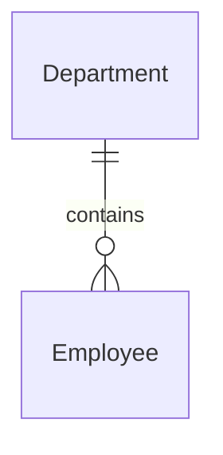
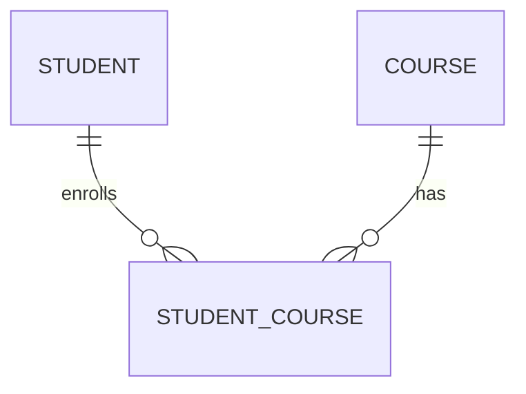

# Many-to-Many (M:N) and Many-to-One (M:1) Relationships in Databases

> These two relationships confuse many developers because **Many-to-One (M:1)** and **One-to-Many (1:M)** are actually the **same relationship viewed from opposite directions**, whereas **Many-to-Many (M:N)** is a completely different relationship that always requires a bridge (junction) table.

---

# Quick Summary

| Relationship | Meaning | Foreign Key Location | Junction Table |
|--------------|----------|----------------------|----------------|
| 1 : Many | One parent has many children | Child table | ❌ No |
| Many : 1 | Many children belong to one parent | Child table | ❌ No |
| Many : Many | Many records relate to many records | Bridge table | ✅ Yes |

---

# Understanding M:1 (Many-to-One)

## Definition

Many records in one table are associated with **one record** in another table.

Think from the **child's perspective**.

```
Many Employees
        │
        ▼
One Department
```

Every employee belongs to **one** department.

---

# Internal Database Representation

```
Department
-------------------------
DepartmentId (PK)
Name

Employee
-------------------------
EmployeeId (PK)
Name
DepartmentId (FK)
```

Notice:

Every employee stores only one `DepartmentId`.

---

# Example 1 — Employee → Department

## Business Rule

- One department has many employees.
- One employee works in one department.

### Data

### Department

| DepartmentId | Name |
|--------------|------|
| 1 | IT |
| 2 | HR |
| 3 | Finance |

### Employee

| EmployeeId | Name | DepartmentId |
|------------|------|--------------|
| 101 | Amit | 1 |
| 102 | Rahul | 1 |
| 103 | Neha | 2 |
| 104 | John | 1 |

Looking from Employee:

```
Amit
Rahul
John
   │
   ▼
IT Department
```

Many Employees

↓

One Department

Relationship = **Many : One**

---

# SQL

```sql
CREATE TABLE Department
(
    DepartmentId INT PRIMARY KEY,
    Name NVARCHAR(100)
);

CREATE TABLE Employee
(
    EmployeeId INT PRIMARY KEY,
    Name NVARCHAR(100),

    DepartmentId INT NOT NULL,

    FOREIGN KEY (DepartmentId)
    REFERENCES Department(DepartmentId)
);
```

---

# Example 2 — Orders → Customer

Business Rule

One customer places many orders.

Looking from Orders

```
Order1
Order2
Order3

↓

Customer
```

Many Orders

↓

One Customer

### Tables

Customer

| CustomerId | Name |
|------------|------|
| 1 | Amit |

Orders

| OrderId | CustomerId |
|----------|------------|
| 100 | 1 |
| 101 | 1 |
| 102 | 1 |

Every order stores

```
CustomerId
```

---

# Example 3 — Transactions → Bank Account

```
Transaction1
Transaction2
Transaction3

↓

Savings Account
```

Many transactions

↓

One account

---

# Example 4 — Books → Publisher

Many books

↓

One publisher

```
Harry Potter
.NET Guide
SQL Deep Dive

↓

Penguin
```

---

# Example 5 — Products → Supplier

```
Laptop

Mouse

Keyboard

↓

Dell Supplier
```

Many products

↓

One supplier

---

# Example 6 — Flight → Airline

```
Flight AI101

Flight AI102

Flight AI103

↓

Air India
```

---

# Example 7 — Invoice → Customer

```
Invoice1

Invoice2

Invoice3

↓

Customer
```

---

# Example 8 — API Logs → Application

```
Log1

Log2

Log3

↓

Inventory Service
```

---

# Example 9 — Azure Function Invocation → Function App

Thousands of invocations

↓

One Function App

---

# Example 10 — Git Commit → Repository

Millions of commits

↓

One repository

---

# Characteristics of M:1

- Child stores Foreign Key.
- Parent doesn't store child IDs.
- Easy to query.
- Highly scalable.
- Most common relationship.

---

# Visual Diagram



---

# Understanding Many-to-Many (M:N)

## Definition

Many records from Table A can relate to many records from Table B.

Neither table can directly store the relationship.

Need

```
Bridge Table
```

---

# Why?

Imagine

```
Student

↓

Courses
```

One student

```
Math

Physics

Chemistry
```

Another student

```
Physics

AI

Math
```

Can Student table store all course IDs?

```
Student

CourseIds

1,3,5
```

❌ Terrible design

Violates normalization.

---

# Correct Design

```
Student

Course

StudentCourse
```

---

# SQL

```sql
CREATE TABLE Student
(
    StudentId INT PRIMARY KEY,
    Name NVARCHAR(100)
);

CREATE TABLE Course
(
    CourseId INT PRIMARY KEY,
    Name NVARCHAR(100)
);

CREATE TABLE StudentCourse
(
    StudentId INT,
    CourseId INT,

    PRIMARY KEY(StudentId, CourseId),

    FOREIGN KEY(StudentId)
        REFERENCES Student(StudentId),

    FOREIGN KEY(CourseId)
        REFERENCES Course(CourseId)
);
```

---

# Example 1 — Students and Courses

Students

| Student |
|----------|
| Amit |
| Rahul |

Courses

| Course |
|--------|
| SQL |
| AI |
| C# |

StudentCourse

| Student | Course |
|----------|--------|
| Amit | SQL |
| Amit | AI |
| Rahul | SQL |
| Rahul | C# |

Notice

SQL has many students.

Amit has many courses.

---

# Example 2 — Users and Roles

Users

```
Amit

Rahul
```

Roles

```
Admin

Reviewer

Developer
```

Amit

```
Admin

Developer
```

Rahul

```
Reviewer

Developer
```

Need

```
UserRole
```

---

# Example 3 — Products and Categories

Laptop belongs to

```
Electronics

Computers

Office
```

Category

Electronics

contains

```
Laptop

Phone

TV
```

Need

```
ProductCategory
```

---

# Example 4 — Doctors and Patients

One doctor

↓

Many patients

One patient

↓

Many doctors

Need

```
DoctorPatient
```

Usually

```
Appointment
```

---

# Example 5 — Orders and Products

One order

↓

Many products

One product

↓

Many orders

Need

```
OrderItem
```

```
OrderItem

OrderId

ProductId

Quantity

Price

Discount
```

Notice

Bridge table has business data.

---

# Example 6 — Employees and Projects

```
Employee

↓

Projects

Many
```

```
Project

↓

Employees

Many
```

Need

```
EmployeeProject
```

---

# Example 7 — Movies and Actors

```
Movie

↓

Actors

Many
```

```
Actor

↓

Movies

Many
```

Need

```
MovieActor
```

---

# Example 8 — Customers and Coupons

One customer

↓

Many coupons

One coupon

↓

Used by many customers

Need

```
CustomerCoupon
```

---

# Example 9 — Warehouses and Products

Warehouse

↓

Many products

Product

↓

Stored in many warehouses

Need

```
WarehouseInventory
```

```
WarehouseId

ProductId

Quantity
```

---

# Example 10 — GitHub Repositories and Contributors

One contributor

↓

Many repositories

One repository

↓

Many contributors

Need

```
RepositoryContributor
```

---

# Visual Diagram



---

# How Bridge Table Works

Instead of

```
Student

CourseIds

1,2,3
```

Store

```
StudentCourse

StudentId

CourseId
```

Like

| Student | Course |
|----------|--------|
| 1 | 10 |
| 1 | 20 |
| 2 | 10 |
| 2 | 30 |

Very efficient.

---

# Why Bridge Tables Become Business Tables

Initially

```
StudentCourse
```

Later

Business asks

Store

- Enrollment Date
- Marks
- Attendance
- Grade

Now

```
StudentCourse

StudentId

CourseId

EnrollmentDate

Grade

Attendance
```

It becomes a business entity.

---

# Performance Comparison

| Feature | M:1 | M:N |
|----------|-----|-----|
| Foreign Key | Child | Bridge Table |
| Extra Table | No | Yes |
| Number of Joins | 1 | 2 |
| Query Speed | Faster | Slightly Slower |
| Storage | Less | More |
| Complexity | Low | Medium |
| Normalization | Easy | Requires Junction Table |

---

# Best Practices

## For Many-to-One

- Always create an index on the foreign key.
- Use `NOT NULL` if every child must belong to a parent.
- Use foreign key constraints to enforce integrity.
- Avoid storing parent names repeatedly in the child table.

---

## For Many-to-Many

- Never store multiple IDs in one column (`1,2,3`).
- Always use a bridge table.
- Use a composite primary key (`ParentId`, `ChildId`) or a surrogate key with a unique constraint.
- Index both foreign keys for efficient lookups.
- Add business attributes (Quantity, Role, Grade, CreatedOn) to the bridge table when appropriate.

---

# Real-World Examples

| Domain | M:1 Example | M:N Example |
|----------|------------|------------|
| Banking | Transaction → Account | Customer ↔ Loan (Joint Loan) |
| E-Commerce | Order → Customer | Product ↔ Category |
| Healthcare | Prescription → Patient | Doctor ↔ Patient |
| Education | Student → Department | Student ↔ Course |
| Logistics | Shipment → Warehouse | Driver ↔ Vehicle (shared fleets) |
| Social Media |
