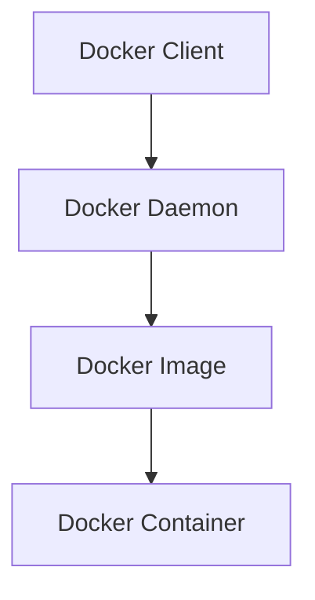

# Docker Explained in Detail
## Complete Guide (Beginner → Architect | 10+ Years Experience)

> **Interview Level:** ⭐⭐⭐⭐⭐
>
> Docker is one of the most frequently asked DevOps and Cloud interview topics.
>
> Companies like:
>
> - Microsoft
> - Amazon
> - Google
> - Netflix
> - UBS
> - JP Morgan
> - Goldman Sachs
> - Point72
>
> expect candidates to understand **how Docker works internally**, not just Docker commands.

---

# Table of Contents

1. Goal
2. Problem Before Docker
3. What is Docker?
4. Virtual Machine vs Docker
5. Docker Architecture
6. Internal Working
7. Docker Components
8. Docker Lifecycle
9. Images
10. Containers
11. Dockerfile
12. Volumes
13. Networks
14. Docker Compose
15. Best Practices
16. Common Mistakes
17. Interview Questions

---

# Goal

Let's understand why Docker was created.

Imagine you're developing a Banking API.

You develop it on your laptop.

Everything works perfectly.

You send the code to QA.

QA says

```
Application not working.
```

You send it to Production.

Production says

```
Works on Dev

Fails on Server.
```

Why?

---

# Problem Before Docker

Developer Machine

```text
Windows

.NET 8

SQL Server

Redis

Node 20
```

QA Machine

```text
Linux

.NET 6

Redis Missing

Different Configuration
```

Production

```text
Ubuntu

Different Libraries

Different Runtime
```

Every machine is different.

---

# Famous Problem

```
Works on My Machine
```

This was one of the biggest deployment problems.

---

# Solution

Package everything together.

```
Application

+

.NET Runtime

+

Libraries

+

Configuration

=

Docker Image
```

Run the same image everywhere.

---

# What is Docker?

## Definition

Docker is a **containerization platform**.

It packages an application along with its dependencies into a **Container**, ensuring it behaves the same in every environment.

---

# Real-World Analogy

Imagine ordering food.

Without Docker

Restaurant sends

- Rice
- Curry
- Plates
- Spoon

You arrange everything.

With Docker

Restaurant sends

a sealed lunch box.

Open it.

Eat.

Everything required is already inside.

---

# Virtual Machine vs Docker

Before Docker

People used

Virtual Machines.

---

## Virtual Machine

```text
Application

↓

Guest OS

↓

Hypervisor

↓

Host OS

↓

Hardware
```

Each VM has

its own OS.

Heavy.

---

## Docker

```text
Application

↓

Libraries

↓

Docker Engine

↓

Host OS

↓

Hardware
```

Containers share the Host OS kernel.

No Guest OS.

Lightweight.

---

# VM vs Docker

| Virtual Machine | Docker |
|-----------------|---------|
| Full Guest OS | Shares Host OS Kernel |
| Heavy | Lightweight |
| Slow Startup | Starts in Seconds |
| More Memory | Less Memory |
| Lower Density | Higher Density |

---

# Docker Architecture



---

# Components

## Docker Client

Commands like

```bash
docker build

docker run

docker ps
```

are sent from Client.

---

## Docker Daemon

Background service.

Responsibilities

- Build Images
- Create Containers
- Pull Images
- Manage Networks
- Manage Volumes

---

## Docker Registry

Stores Images.

Example

Docker Hub

Azure Container Registry (ACR)

GitHub Container Registry

---

# Internal Working

Suppose you execute

```bash
docker run nginx
```

What happens?

---

## Step 1

Docker Client sends

```
Run nginx
```

to Docker Daemon.

---

## Step 2

Daemon checks

```
Image Exists?
```

---

If No

↓

Downloads

from

Docker Hub.

---

## Step 3

Creates

Container

using Image.

---

## Step 4

Allocates

- Network
- File System
- CPU
- Memory

---

## Step 5

Starts

Main Process.

Container running.

---

# Complete Flow

```text
docker run nginx

↓

Docker Client

↓

Docker Daemon

↓

Pull Image

↓

Create Writable Layer

↓

Allocate Resources

↓

Start Process

↓

Container Running
```

---

# What is a Docker Image?

## Definition

Image is a

```
Blueprint

Template

Read-only Package
```

Contains

- Application
- Runtime
- Libraries
- Dependencies
- Configuration

---

Example

```
aspnet:8.0
```

---

# What is a Container?

Container is

```
Running Instance

of an Image.
```

Example

```
Image

↓

aspnet:8.0

↓

Container

↓

Running Banking API
```

---

# Image vs Container

| Image | Container |
|---------|------------|
| Template | Running Instance |
| Read Only | Read + Write Layer |
| Immutable | Temporary |

---

# Dockerfile

Dockerfile tells Docker

how to build an image.

Example

```dockerfile
FROM mcr.microsoft.com/dotnet/aspnet:8.0

WORKDIR /app

COPY . .

ENTRYPOINT ["dotnet","Banking.dll"]
```

---

# Docker Build

```bash
docker build -t banking-api .
```

Creates

Image.

---

# Docker Run

```bash
docker run -p 8080:80 banking-api
```

Starts

Container.

---

# Docker Layers

Every instruction

creates

a Layer.

```dockerfile
FROM

COPY

RUN

ENTRYPOINT
```

↓

Layer

↓

Layer

↓

Layer

↓

Layer

Layers are cached.

If only source code changes,

base image isn't rebuilt.

This makes builds faster.

---

# Container Lifecycle

```text
Image

↓

Create

↓

Running

↓

Paused

↓

Stopped

↓

Removed
```

---

# Docker Networking

By default

Containers

cannot be reached externally.

Need

Port Mapping.

Example

```bash
docker run -p 5000:80 banking-api
```

Meaning

```
Host

5000

↓

Container

80
```

---

# Docker Volumes

Problem

Container deleted.

Data lost.

Need

Persistent Storage.

Solution

Volumes.

Example

```bash
docker volume create sql-data
```

---

Without Volume

```
Container Deleted

↓

Database Lost
```

---

With Volume

```
Container Deleted

↓

Volume Exists

↓

Data Safe
```

---

# Docker Networks

Containers communicate

using Networks.

Example

```text
Banking API

↓

SQL Server

↓

Redis
```

All

inside same

Docker Network.

---

# Docker Compose

Suppose

Need

- API
- SQL
- Redis

Three containers.

Instead of running three commands,

use

```yaml
services:

 api:

 sql:

 redis:
```

Run

```bash
docker compose up
```

Everything starts together.

---

# Example

```yaml
version: "3.9"

services:

  api:
    image: banking-api
    ports:
      - "8080:80"

  sql:
    image: mcr.microsoft.com/mssql/server

  redis:
    image: redis
```

---

# Multi-Stage Build

Bad

```dockerfile
SDK

Runtime

Source

Everything

inside one image.
```

Large Image.

---

Good

```dockerfile
Build Stage

↓

Publish

↓

Runtime Stage
```

Only runtime files

go into final image.

Smaller.

Faster.

---

# Production Flow

Developer

↓

Git Push

↓

Azure DevOps

↓

Build Docker Image

↓

Push to Azure Container Registry

↓

Deploy

↓

AKS / App Service

---

# Best Practices

- Use official base images.
- Use multi-stage builds.
- Keep images small.
- Don't run containers as root.
- Use environment variables.
- Store secrets in Key Vault/Kubernetes Secrets.
- Use health checks.
- Pin image versions instead of `latest`.
- Scan images for vulnerabilities.
- Keep one main process per container.

---

# Common Mistakes

❌ Using `latest` tag.

---

❌ Storing passwords in Dockerfile.

---

❌ Huge Images.

---

❌ Running as root.

---

❌ No Health Check.

---

❌ Writing logs inside the container filesystem instead of stdout/stderr.

---

# Docker Commands

```bash
docker build

docker images

docker run

docker ps

docker stop

docker start

docker restart

docker logs

docker exec

docker inspect

docker rm

docker rmi

docker volume ls

docker network ls

docker compose up

docker compose down
```

---

# Docker vs Kubernetes

| Docker | Kubernetes |
|----------|------------|
| Creates Containers | Manages Containers |
| Single Host | Cluster |
| Packaging | Orchestration |
| Image Execution | Scaling & Scheduling |

Docker runs containers.

Kubernetes manages thousands of containers.

---

# Docker vs Virtual Machine

| Docker | Virtual Machine |
|----------|----------------|
| Shared OS Kernel | Guest OS |
| Lightweight | Heavy |
| Fast Startup | Slower |
| Low Memory | High Memory |

---

# Real Banking Example (UBS)

Application

```
Banking API

↓

Docker Image

↓

Azure Container Registry

↓

AKS

↓

Azure SQL

↓

Redis

↓

Service Bus
```

Same image

runs in

Dev

QA

UAT

Production

No environment differences.

---

# Common Interview Questions

## Beginner

### What is Docker?

A containerization platform that packages applications with their dependencies.

---

### What is an Image?

A read-only template used to create containers.

---

### What is a Container?

A running instance of an image.

---

### Difference between Image and Container?

Image is the blueprint.

Container is the running application.

---

### Why Docker?

To ensure applications run consistently across different environments.

---

## Intermediate

### Docker vs Virtual Machine?

Docker shares the host OS kernel.

VM has its own Guest OS.

---

### What is Dockerfile?

A file containing instructions for building an image.

---

### What are Volumes?

Persistent storage independent of the container lifecycle.

---

### What is Docker Compose?

Tool for defining and running multiple containers together.

---

### What is Port Mapping?

Maps a host machine port to a container port.

Example

```
8080:80
```

---

## Senior (10+ Years)

### Question

Explain Docker Architecture.

### Expected Answer

```
Docker Client

↓

Docker Daemon

↓

Docker Image

↓

Docker Container
```

Client sends commands.

Daemon performs operations.

Images create Containers.

---

### Question

How does Docker work internally?

### Expected Answer

1. Docker Client sends command.
2. Docker Daemon checks image.
3. Pulls image if required.
4. Creates writable container layer.
5. Configures namespaces and networking.
6. Applies resource limits (if configured).
7. Starts the container's main process.

---

### Question

Why are Docker Images small?

### Expected Answer

Docker images use layered filesystems. Layers are reused across images and cached locally. Multi-stage builds further reduce the final image size by excluding build tools.

---

### Question

Why use Multi-Stage Builds?

### Expected Answer

To separate the build environment from the runtime environment. The final image contains only the published application and runtime, making it smaller, more secure, and faster to deploy.

---

### Question

Can two containers communicate?

### Expected Answer

Yes.

If they are on the same Docker network, they can communicate using container names as DNS hostnames.

---

### Question

Where should secrets be stored?

### Expected Answer

Never inside the Dockerfile or image.

Use:

- Azure Key Vault
- Kubernetes Secrets
- Docker Secrets (Swarm)
- Environment variables (for non-sensitive configuration)

---

### Question

What happens if a container crashes?

### Expected Answer

The main process exits, causing the container to stop. Depending on the restart policy or an orchestrator like Kubernetes, the container may be restarted automatically.

---

### Question

Difference between CMD and ENTRYPOINT?

| CMD | ENTRYPOINT |
|------|------------|
| Default command (can be overridden easily) | Defines the main executable |
| Optional | Usually mandatory |

Example

```dockerfile
ENTRYPOINT ["dotnet", "Banking.dll"]
CMD ["--environment=Production"]
```

---

# Easy Analogy

Think of Docker like shipping containers.

- **Image** = Standardized empty shipping container design.
- **Container** = A shipping container loaded with goods.
- **Docker Engine** = The crane that loads and unloads containers.
- **Docker Registry** = The shipping port where containers are stored.
- **Kubernetes** = The port authority that decides where thousands of containers should be placed and restarted.

This standardization allows the same container to move between ships, trucks, and trains—just as a Docker container runs consistently on development, testing, and production environments.

---

# One-Line Interview Answer

> **Docker is a containerization platform that packages an application, its runtime, libraries, and dependencies into an immutable image. Docker Engine creates isolated containers from these images using the host operating system's kernel, ensuring consistent, lightweight, and portable application execution across different environments.**