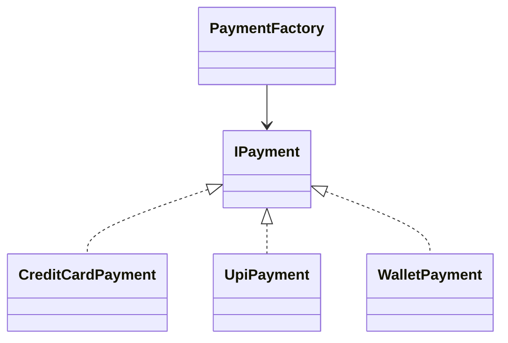

# Factory Design Pattern
## Complete Guide (Beginner → Architect | 10+ Years Experience)

> **Interview Level:** ⭐⭐⭐⭐⭐
>
> The Factory Design Pattern is one of the most commonly asked design patterns in .NET interviews.
>
> Companies like:
>
> - Microsoft
> - Amazon
> - Google
> - UBS
> - Goldman Sachs
> - JP Morgan
> - Point72
>
> frequently ask:
>
> - What is Factory Pattern?
> - Why do we need it?
> - What problem does it solve?
> - How does it work internally?
> - Where have you used it?

---

# Table of Contents

1. Goal
2. Problem
3. Without Factory
4. What is Factory Pattern?
5. Internal Working
6. Real-world Example
7. C# Example
8. UML Diagram
9. Advantages
10. Disadvantages
11. Factory vs Simple Factory vs Abstract Factory
12. Best Practices
13. Common Mistakes
14. Interview Questions

---

# Goal

Let's understand **why Factory Pattern exists**.

Imagine you are building a Banking Application.

Customer chooses

```
Credit Card

UPI

Net Banking

Wallet
```

Question:

How will your application create the correct payment object?

---

# Without Factory

Most beginners write

```csharp
if (paymentType == "CreditCard")
{
    payment = new CreditCardPayment();
}
else if (paymentType == "UPI")
{
    payment = new UpiPayment();
}
else if (paymentType == "Wallet")
{
    payment = new WalletPayment();
}
```

Looks fine.

But after six months...

Business adds:

- Apple Pay
- Google Pay
- Crypto
- Gift Card
- EMI

Now the code becomes

```text
if...

else if...

else if...

else if...

else if...

else if...
```

Problems:

- Huge code
- Hard to maintain
- Violates Open/Closed Principle
- Every new payment method requires modifying existing code

---

# The Problem

Suppose

Tomorrow

Business says

```
Add PayPal
```

Where do you change?

Everywhere that creates payment objects.

This leads to

- Duplicate code
- Bugs
- Tight coupling

---

# Solution

Move object creation

into one place.

That place is called

```
Factory
```

---

# What is Factory Design Pattern?

## Definition

Factory Pattern provides a **centralized way of creating objects** without exposing object creation logic to the client.

Instead of

```csharp
new CreditCardPayment()
```

Client asks

```
Factory

↓

Give me Payment Object
```

Factory decides

which object to create.

---

# Real-World Analogy

Imagine ordering coffee.

Without Factory

You enter the kitchen.

Choose beans.

Boil water.

Add milk.

Prepare coffee yourself.

---

With Factory

You simply tell the barista

```
Latte
```

The barista prepares it.

You don't care

how.

Factory works exactly like the barista.

---

# Architecture

```text
Client

↓

Factory

↓

Concrete Object

↓

Use Object
```

---

# UML Diagram



---

# Step-by-Step Internal Working

Suppose

Customer selects

```
UPI
```

---

## Step 1

Client calls

```csharp
PaymentFactory.Create("UPI");
```

---

## Step 2

Factory checks

```
Payment Type

↓

UPI
```

---

## Step 3

Factory creates

```csharp
new UpiPayment();
```

---

## Step 4

Returns

```
IPayment
```

---

## Step 5

Client simply uses it

```csharp
payment.Pay();
```

Client never knows

which class was created.

---

# C# Example

## Step 1 - Interface

```csharp
public interface IPayment
{
    void Pay(decimal amount);
}
```

---

## Step 2 - Implementations

### Credit Card

```csharp
public class CreditCardPayment : IPayment
{
    public void Pay(decimal amount)
    {
        Console.WriteLine($"Paid ₹{amount} using Credit Card");
    }
}
```

---

### UPI

```csharp
public class UpiPayment : IPayment
{
    public void Pay(decimal amount)
    {
        Console.WriteLine($"Paid ₹{amount} using UPI");
    }
}
```

---

### Wallet

```csharp
public class WalletPayment : IPayment
{
    public void Pay(decimal amount)
    {
        Console.WriteLine($"Paid ₹{amount} using Wallet");
    }
}
```

---

## Step 3 - Factory

```csharp
public static class PaymentFactory
{
    public static IPayment Create(string paymentType)
    {
        return paymentType switch
        {
            "CreditCard" => new CreditCardPayment(),
            "UPI" => new UpiPayment(),
            "Wallet" => new WalletPayment(),
            _ => throw new ArgumentException("Invalid Payment Type")
        };
    }
}
```

---

## Step 4 - Client

```csharp
class Program
{
    static void Main()
    {
        IPayment payment = PaymentFactory.Create("UPI");

        payment.Pay(500);
    }
}
```

Output

```text
Paid ₹500 using UPI
```

---

# Flow Diagram

```text
User

↓

UPI

↓

PaymentFactory

↓

UpiPayment

↓

Pay()
```

---

# Why Interface?

Question

Why not return

```
UpiPayment
```

Instead of

```
IPayment
```

Answer

Tomorrow

Business adds

```
CryptoPayment
```

Client code

doesn't change.

Only Factory changes.

This follows

**Programming to an Interface**.

---

# Real-World Banking Example

Customer clicks

```
Transfer Money
```

Payment Mode

```
NEFT

RTGS

IMPS

UPI
```

Instead of

```csharp
new NEFTService()
```

Call

```csharp
TransferFactory.Create("NEFT");
```

Factory returns

appropriate implementation.

---

# Another Example - Notification

Notification Types

```
Email

SMS

Push Notification

WhatsApp
```

Factory

```csharp
NotificationFactory.Create("SMS");
```

Returns

```csharp
SmsNotification
```

---

# Another Example - Azure Storage

Upload File

Storage Type

```
Azure Blob

AWS S3

Google Cloud Storage
```

Factory

creates

appropriate storage provider.

---

# Advantages

- Centralized object creation.
- Loose coupling.
- Easier maintenance.
- Easier testing (mock interfaces).
- Supports Open/Closed Principle.
- Client doesn't know concrete classes.

---

# Disadvantages

- Additional classes.
- Factory can become very large if not designed properly.
- Slightly more complex for small applications.

---

# Factory vs Simple Factory vs Abstract Factory

| Feature | Simple Factory | Factory Method | Abstract Factory |
|----------|---------------|----------------|------------------|
| Object Creation | One Factory Class | Factory inherited by subclasses | Factory of related objects |
| Complexity | Low | Medium | High |
| Extensibility | Moderate | High | Very High |

---

# Factory Pattern in .NET

You use Factory Pattern every day.

Example

```csharp
ILogger logger =
    loggerFactory.CreateLogger("Program");
```

`ILoggerFactory` decides which logger implementation to create.

Another example

```csharp
IHttpClientFactory
```

Instead of

```csharp
new HttpClient()
```

ASP.NET Core creates and manages `HttpClient` instances through the factory.

---

# Factory + Dependency Injection

Instead of

```csharp
new SqlRepository();
```

Use

```csharp
builder.Services.AddScoped<IRepository, SqlRepository>();
```

ASP.NET Core's DI container acts as a sophisticated factory.

---

# Best Practices

- Return interfaces, not concrete classes.
- Keep creation logic inside the factory.
- Throw meaningful exceptions for unsupported types.
- Combine with Dependency Injection.
- Avoid large `if-else` chains; prefer dictionaries or registration mechanisms for many implementations.

---

# Common Mistakes

## ❌ Returning Concrete Classes

Wrong

```csharp
CreditCardPayment payment =
    new CreditCardPayment();
```

Correct

```csharp
IPayment payment =
    PaymentFactory.Create("CreditCard");
```

---

## ❌ Business Logic Inside Factory

Factory should create objects.

Business logic belongs elsewhere.

---

## ❌ Giant Factory

If a factory creates

100 different objects,

split it into

smaller factories.

---

# When Should You Use Factory Pattern?

Use when

- Object creation is complex.
- Many implementations exist.
- Client shouldn't know implementation details.
- You want loose coupling.
- Object creation may change over time.

Don't use it when

- Only one implementation exists.
- Object creation is simple and unlikely to change.

---

# Performance

| Aspect | Impact |
|---------|--------|
| Object Creation | Very Small Overhead |
| Memory | Same as normal object creation |
| Scalability | Excellent |
| Maintainability | Excellent |

---

# Interview Questions

## Beginner

### What is Factory Pattern?

A creational design pattern used to centralize object creation.

---

### Why use Factory Pattern?

To hide object creation logic and reduce coupling.

---

### What problem does it solve?

It prevents clients from directly instantiating concrete classes and makes the system easier to extend.

---

## Intermediate

### Factory vs Constructor?

Constructor creates one specific object.

Factory decides which object to create.

---

### Why return an interface?

To hide implementation details and allow future implementations without changing client code.

---

### Where have you used Factory Pattern?

- Payment gateways
- Notification systems
- Cloud storage providers
- Logging
- Repository creation
- ASP.NET Core `IHttpClientFactory`

---

## Senior (10+ Years)

### Question

Why is Factory Pattern considered loosely coupled?

### Why Interviewers Ask

To check your understanding of SOLID principles.

### Expected Answer

The client depends only on an abstraction (interface), not on concrete implementations. New implementations can be introduced with minimal changes to client code.

---

### Question

How does Dependency Injection relate to Factory Pattern?

### Expected Answer

The DI container is effectively an advanced factory. It resolves dependencies, manages object lifetimes (Singleton, Scoped, Transient), and creates object graphs automatically.

---

### Question

How would you avoid modifying the Factory every time a new implementation is added?

### Expected Answer

Use:

- Dependency Injection
- Registration dictionaries
- Reflection (carefully)
- Configuration-based mappings

This keeps the factory open for extension and minimizes code changes.

---

### Question

Factory Pattern vs Strategy Pattern?

| Factory | Strategy |
|----------|----------|
| Creates objects | Chooses behavior |
| Focuses on instantiation | Focuses on algorithms |
| Used at creation time | Used during execution |

---

# Easy Analogy

Imagine a car showroom.

Without Factory:

You go to the manufacturing plant and build the car yourself.

With Factory:

You tell the showroom:

> "I want an SUV."

The showroom decides which model to provide and hands you the keys.

You don't need to know how the car was manufactured.

That's exactly how the Factory Pattern works.

---

# One-Line Interview Answer

> **The Factory Design Pattern is a creational design pattern that centralizes object creation, hides implementation details from clients, returns abstractions instead of concrete classes, and promotes loose coupling, maintainability, and extensibility.**