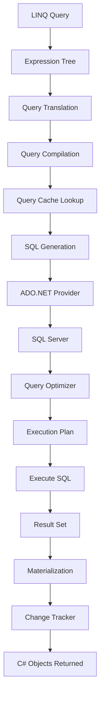

# Explain the Entire Lifecycle of an Entity Framework (EF Core) Query
## Complete Internal Working (Beginner → Architect Level)

> **Interview Level:** ⭐⭐⭐⭐⭐
>
> This is one of the most common questions for **Senior .NET Developers (10+ Years)**.
>
> Interviewers are not interested in whether you know LINQ.
>
> They want to know **what happens internally after you write a LINQ query**.

---

# Example We'll Use

Suppose we have a Banking Application.

Customer Table

| CustomerId | Name | City | IsActive |
|------------|------|------|----------|
| 1 | Amit | Pune | 1 |
| 2 | Rahul | Delhi | 1 |
| 3 | Neha | Pune | 0 |

Customer Entity

```csharp
public class Customer
{
    public int CustomerId { get; set; }

    public string Name { get; set; }

    public string City { get; set; }

    public bool IsActive { get; set; }
}
```

DbContext

```csharp
public class BankingDbContext : DbContext
{
    public DbSet<Customer> Customers => Set<Customer>();
}
```

Our LINQ Query

```csharp
var customers = await _context.Customers
    .Where(c => c.City == "Pune")
    .OrderBy(c => c.Name)
    .ToListAsync();
```

Now let's see **what happens internally**.

---

# Complete Lifecycle

```text
Developer writes LINQ

        │

        ▼

Expression Tree Created

        │

        ▼

Query Translation

        │

        ▼

Query Compilation

        │

        ▼

Query Cache Lookup

        │

        ▼

SQL Generation

        │

        ▼

ADO.NET

        │

        ▼

SQL Server

        │

        ▼

Execution Plan

        │

        ▼

Database Execution

        │

        ▼

Result Set Returned

        │

        ▼

Materialization

        │

        ▼

Change Tracker

        │

        ▼

Objects Returned
```

---

# Step 1 — LINQ Query

This is what you write.

```csharp
var customers = await _context.Customers
    .Where(c => c.City == "Pune")
    .OrderBy(c => c.Name)
    .ToListAsync();
```

Looks simple.

But EF Core doesn't execute SQL immediately.

---

# What Happens?

EF first analyzes your LINQ.

Think of LINQ as

```
Human Language
```

EF must convert it into

```
SQL Language
```

---

# Real World Analogy

Imagine

```
English

↓

Google Translate

↓

Japanese
```

Same idea.

LINQ

↓

SQL

---

# Step 2 — Expression Tree Creation

Most developers think EF executes the lambda immediately.

It doesn't.

Instead

```csharp
.Where(c => c.City == "Pune")
```

becomes

```
Expression Tree
```

Internally

```text
Where

│

├── Property

│     City

│

├── Operator

│     ==

│

└── Constant

      Pune
```

EF now has a tree representing your query.

---

# Why Expression Trees?

Because EF needs to understand

```
What

to query

instead of

executing immediately.
```

Expression Trees are data structures that describe code.

Not execute code.

---

# Step 3 — Query Translation

EF now translates

Expression Tree

↓

Database-specific SQL.

Our tree

```
City == Pune
```

becomes

```sql
WHERE City='Pune'
```

OrderBy

↓

```sql
ORDER BY Name
```

---

# Internal Translation

Expression

```
Where

↓

SQL WHERE
```

OrderBy

↓

SQL ORDER BY

Select

↓

SQL SELECT

Take

↓

TOP

Skip

↓

OFFSET

---

# Step 4 — Query Compilation

Now EF builds an executable query.

Think

```
Expression Tree

↓

Compiled Database Query
```

Internally EF creates a query execution plan.

Not SQL Server's plan.

EF's own compiled representation.

---

# Why Compile?

Imagine running

```csharp
_context.Customers

.Where(x=>x.City=="Pune")
```

1000 times.

Without compilation

EF would analyze

Expression Tree

1000 times.

Compilation avoids repeating expensive work.

---

# Step 5 — Query Cache Lookup

EF checks

```
Have I already compiled this query?
```

Suppose

```
City=="Pune"
```

already executed.

EF says

```
Great.

I'll reuse it.
```

No recompilation.

---

# Example

First Request

```csharp
.Where(x=>x.City=="Pune")
```

Compile.

Second Request

```csharp
.Where(x=>x.City=="Pune")
```

Reuse.

Faster.

---

# Important

Query Shape matters.

These two queries have the same shape:

```csharp
.Where(c => c.City == city)
```

```csharp
.Where(c => c.City == anotherCity)
```

EF parameterizes them:

```sql
WHERE City = @__city_0
```

The compiled query is reused regardless of the parameter value.

However, these have **different shapes**:

```csharp
.Where(c => c.City == city)
```

```csharp
.Where(c => c.City == city)
.OrderBy(c => c.Name)
```

Second query requires a different compilation.

---

# Step 6 — SQL Generation

Now EF generates SQL.

Generated SQL

```sql
SELECT
    CustomerId,
    Name,
    City,
    IsActive
FROM Customers
WHERE City = @__city_0
ORDER BY Name;
```

Notice

Parameterized Query.

Not

```sql
WHERE City='Pune'
```

Parameterization prevents SQL Injection and allows SQL Server to reuse execution plans.

---

# See Generated SQL

```csharp
var sql = _context.Customers
    .Where(c => c.City == "Pune")
    .ToQueryString();

Console.WriteLine(sql);
```

---

# Step 7 — ADO.NET

EF doesn't talk to SQL Server directly.

It uses ADO.NET.

```
EF Core

↓

Microsoft.Data.SqlClient

↓

TCP

↓

SQL Server
```

ADO.NET opens a pooled SQL connection, creates a `DbCommand`, binds parameters, and sends the SQL.

---

# Example

Internally

```csharp
SqlCommand command = new SqlCommand(sql);

command.Parameters.AddWithValue("@__city_0", "Pune");
```

---

# Step 8 — SQL Server Receives Query

SQL Server receives

```sql
SELECT *
FROM Customers
WHERE City=@__city_0
```

---

# SQL Server Creates Execution Plan

Before executing

SQL Server asks

```
What's the fastest way?
```

Possible plans

```
Index Seek

Table Scan

Clustered Index Scan

Hash Match

Nested Loop
```

---

# Example

If

```
City

has an index
```

SQL Server performs

```
Index Seek
```

Fast.

Without index

```
Table Scan
```

Slow.

---

# Example Execution Plan

```
SELECT

↓

Optimizer

↓

Index Seek

↓

Rows Returned
```

---

# Step 9 — Database Executes Query

Rows found

```
Amit

Rahul
```

Database returns

Raw Data

```
1

Amit

Pune

True
```

---

# Step 10 — Result Set Returned

ADO.NET receives

```
Tabular Data
```

Not C# Objects.

Example

```
1

Amit

Pune

True
```

---

# Step 11 — Materialization

This is a very important interview topic.

Materialization means

```
Database Row

↓

C# Object
```

EF creates

```csharp
new Customer
{
    CustomerId = 1,

    Name = "Amit",

    City = "Pune",

    IsActive = true
}
```

One object per row.

---

# Internal Process

Row

```
1

Amit

Pune
```

↓

Reflection / Compiled Accessors

↓

Customer Object

---

# Step 12 — Change Tracker

By default

EF tracks every entity.

Internal Dictionary

```
CustomerId=1

↓

Customer Object
```

Also stores

```
Original Values

Current Values
```

Later

```csharp
customer.Name = "Amit Sharma";
```

EF knows

```
Name Changed
```

No SQL yet.

---

# Internal State

```
Unchanged

↓

Modified
```

EntityState changes.

---

# Step 13 — Return Objects

Finally

You receive

```csharp
List<Customer>
```

instead of

```
Rows
```

Exactly what you wanted.

---

# What Happens if You Call SaveChanges()

```csharp
customer.Name = "Amit Sharma";

await _context.SaveChangesAsync();
```

Pipeline

```
Detect Changes

↓

Generate UPDATE

↓

Begin Transaction

↓

Execute SQL

↓

Commit

↓

Accept Changes
```

Generated SQL

```sql
UPDATE Customers
SET Name = @p0
WHERE CustomerId = @p1;
```

---

# Internal Memory Diagram

Before Query

```
DbContext

↓

Empty
```

After Query

```
DbContext

│

├── Customer(1)

├── Customer(2)

└── Customer(3)
```

Change Tracker now knows every loaded entity (unless `AsNoTracking()` is used).

---

# Performance Considerations

## Read-only Query

Use

```csharp
_context.Customers
    .AsNoTracking()
    .ToListAsync();
```

Benefits

- No Change Tracker
- Less Memory
- Faster
- Lower CPU

---

## Projection

Instead of

```csharp
_context.Customers
```

Use

```csharp
_context.Customers

.Select(c=>new CustomerDto
{
    Name=c.Name
});
```

SQL becomes

```sql
SELECT Name
```

instead of

```sql
SELECT *
```

Much faster.

---

## IQueryable vs IEnumerable

Good

```csharp
_context.Customers

.Where(x=>x.City=="Pune")
```

Filtering happens in SQL.

Bad

```csharp
_context.Customers

.ToList()

.Where(x=>x.City=="Pune")
```

Entire table loads into memory before filtering.

---

# Complete Internal Flow Diagram



---

# Example Timeline

| Stage | Example |
|---------|---------|
| LINQ | `.Where(c => c.City == "Pune")` |
| Expression Tree | `City == "Pune"` represented as a tree |
| Translation | Converts `Where` to SQL `WHERE` |
| Compilation | Builds executable query pipeline |
| Cache | Reuses compiled query if shape matches |
| SQL Generation | `SELECT ... WHERE City = @__city_0` |
| ADO.NET | Sends SQL and parameters to SQL Server |
| SQL Server | Chooses Index Seek or Table Scan |
| Execution | Reads matching rows |
| Materialization | Creates `Customer` objects |
| Change Tracker | Marks entities as `Unchanged` |
| Result | Returns `List<Customer>` |

---

# Common Mistakes

❌ Calling `ToList()` too early.

```csharp
_context.Customers

.ToList()

.Where(...)
```

---

❌ Using Lazy Loading without realizing it causes additional SQL queries (N+1 problem).

---

❌ Selecting entire entities when only two columns are needed.

---

❌ Not using `AsNoTracking()` for read-only APIs.

---

❌ Assuming LINQ always runs in SQL. Some methods cannot be translated and may throw exceptions or require client-side evaluation.

---

# Interview Questions (10+ Years Experience)

## 1. Explain the complete lifecycle of an EF Core query.

Cover:

- LINQ
- Expression Tree
- Translation
- Query Compilation
- Query Cache
- SQL Generation
- ADO.NET
- SQL Server Optimizer
- Execution Plan
- Materialization
- Change Tracker

---

## 2. Why are Expression Trees used instead of delegates?

**Expected Answer**

A delegate is executable code. EF Core cannot inspect it to generate SQL.

An `Expression<Func<T, bool>>` is a data structure describing the code, allowing EF Core to translate it into SQL.

---

## 3. What is query shape, and why does it matter?

Query compilation is cached by **shape**, not parameter values.

This:

```csharp
.Where(c => c.City == city)
```

with different `city` values reuses the same compiled query.

---

## 4. How would you debug a slow EF query?

- Use `ToQueryString()`
- Enable EF Core logging
- Capture generated SQL
- View SQL Server Actual Execution Plan
- Check `SET STATISTICS IO ON`
- Verify indexes
- Profile execution time

---

## 5. Which part usually takes the most time?

In most production systems:

- LINQ translation is usually fast.
- Network latency is often small.
- **Database execution (poor indexes, scans, joins, locking)** is typically the biggest cost.

Optimizing SQL and indexes generally provides much larger gains than micro-optimizing EF Core itself.
