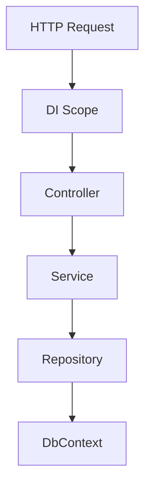

# Transient vs Scoped vs Singleton
## Complete Guide (Beginner → Architect | 10+ Years Experience)

> **Interview Level:** ⭐⭐⭐⭐⭐
>
> Dependency Injection (DI) lifetimes are one of the most frequently asked .NET interview topics.
>
> Interviewers rarely ask only:
>
> **"What is Singleton?"**
>
> Instead, they ask:
>
> - Why do we need DI lifetimes?
> - What happens internally?
> - Which lifetime should I choose?
> - What problems occur if I choose the wrong one?
> - Can Singleton use Scoped?
> - How does ASP.NET Core create these objects?

---

# Table of Contents

1. Goal
2. Why DI Lifetimes Exist
3. ASP.NET Core Request Lifecycle
4. Transient
5. Scoped
6. Singleton
7. Internal Working
8. Comparison
9. Real-world Examples
10. Common Mistakes
11. Best Practices
12. Interview Questions

---

# Goal

Let's first understand **why Microsoft introduced DI lifetimes**.

Imagine an Online Banking Application.

Every HTTP request needs

- Logger
- CustomerService
- DbContext
- Cache
- Configuration

Question

Should ASP.NET Core create

```
New object

every time?
```

OR

```
Reuse

existing object?
```

Different objects have different requirements.

Hence,

DI Lifetimes were introduced.

---

# Problem Without Lifetimes

Suppose

Every request creates

```text
Logger

Database

Cache

Configuration
```

Problems

- Too much memory allocation
- Slow performance
- Expensive object creation
- More Garbage Collection

---

Now imagine

Every request shares

```
DbContext
```

Problem

```
User A

changes data

↓

User B

sees same tracking information

↓

Data corruption
```

Neither approach works for every object.

We need different lifetimes.

---

# ASP.NET Core Request Lifecycle

Suppose

100 users hit

```
GET /api/orders
```

Each request gets

its own DI scope.

```text
Request 1

↓

DI Scope

↓

Controller

↓

Services

↓

DbContext

-------------------

Request 2

↓

DI Scope

↓

Controller

↓

Services

↓

DbContext
```

---

# Three Lifetimes

```text
Transient

↓

Scoped

↓

Singleton
```

---

# 1. Transient

## Definition

Every time the object is requested,

a **new instance** is created.

---

## Registration

```csharp
builder.Services.AddTransient<IEmailService, EmailService>();
```

---

## Example

```csharp
public class OrderService
{
    public OrderService(IEmailService email)
    {
    }
}
```

Every injection

creates

new EmailService.

---

# Internal Working

Request

↓

Need EmailService

↓

DI Container

↓

Create New Object

↓

Return

Next request

↓

Again

Create New Object

---

# Diagram

```text
Request

↓

EmailService

Object 1

----------------

Another Injection

↓

EmailService

Object 2
```

Different objects.

---

# When to Use

Use for

- Lightweight services
- Stateless services
- Business services
- Validators
- Formatters

---

# Real Example

OTP Generator

Every request

creates

new generator.

No shared state.

---

# Advantages

- No shared state.
- Thread-safe by design (if stateless).
- Simple.

---

# Disadvantages

- More object creation.
- Higher GC pressure if overused.

---

# 2. Scoped

## Definition

One instance

per HTTP Request.

---

## Registration

```csharp
builder.Services.AddScoped<IOrderService, OrderService>();
```

---

# Internal Working

Request starts

↓

Create Scope

↓

First injection

↓

Create Object

↓

Reuse same object

↓

Request ends

↓

Dispose object

---

# Diagram

```text
HTTP Request

↓

OrderService

Object A

↓

Controller

↓

Repository

↓

Same Object

↓

Dispose
```

---

# Important

Within

same request

everyone gets

same instance.

---

Second request

↓

New object.

---

# Real Banking Example

Customer transfers money.

Need

```
DbContext
```

Controller

↓

Repository

↓

Audit Service

All should use

same DbContext.

Otherwise

Transaction fails.

Hence

DbContext

is Scoped.

---

# Advantages

- One object per request.
- Supports transactions.
- Efficient.

---

# Disadvantages

Cannot be shared

between requests.

---

# 3. Singleton

## Definition

Only one object

for the

entire application.

---

## Registration

```csharp
builder.Services.AddSingleton<ICacheService, CacheService>();
```

---

# Internal Working

Application Starts

↓

Create Object

↓

Store

↓

Reuse forever

↓

Application Stops

↓

Dispose

---

# Diagram

```text
Application

↓

Singleton Object

↓

Request 1

↓

Request 2

↓

Request 3

↓

Request 10000
```

Same object.

---

# When to Use

- Configuration
- Cache
- Logging
- Feature Flags
- Static Data

---

# Real Example

Currency List

```text
USD

INR

GBP

EUR
```

No need

to reload

every request.

Singleton.

---

# Internal Working of DI Container

Suppose

```csharp
builder.Services.AddScoped<CustomerService>();
```

Request

↓

Controller

↓

Needs CustomerService

↓

Container

↓

Already exists?

↓

No

↓

Create

↓

Store in Scope

↓

Return

Next injection

↓

Reuse

---

# Complete Flow



All

share

same Scoped objects.

---

# Comparison Table

| Feature | Transient | Scoped | Singleton |
|----------|-----------|--------|------------|
| Lifetime | Every Injection | Per Request | Entire Application |
| Object Created | Every Time | Once per Request | Once |
| Memory | High | Medium | Low |
| Thread Safety Required | Usually No | No (per request) | Yes |
| Best For | Stateless Services | DbContext, Business Logic | Cache, Config |

---

# Real Banking Example

## Logger

Need

one logger

for application.

Singleton.

---

## DbContext

Need

same transaction

within request.

Scoped.

---

## Email Sender

No state.

Transient.

---

# Memory Example

Suppose

100 Requests.

Transient

```
1000 Objects
```

Scoped

```
100 Objects
```

Singleton

```
1 Object
```

---

# Thread Safety

Singleton

shared

by

all users.

Need

```csharp
lock

ConcurrentDictionary

SemaphoreSlim
```

if mutable state exists.

---

Transient

Safe.

Scoped

Safe

because

request isolated.

---

# Biggest Interview Question

## Can Singleton use Scoped?

Answer

**No (Directly).**

Example

```csharp
public class CacheService
{
    public CacheService(AppDbContext db)
    {
    }
}
```

Wrong.

Because

Singleton

lives forever.

DbContext

dies

after request.

Now

Singleton

holds

disposed object.

Runtime throws:

```
Cannot consume scoped service
from singleton.
```

---

# Correct Solution

Inject

```csharp
IServiceScopeFactory
```

Create

scope

only

when needed.

```csharp
public class CacheService
{
    private readonly IServiceScopeFactory _scopeFactory;

    public CacheService(IServiceScopeFactory scopeFactory)
    {
        _scopeFactory = scopeFactory;
    }

    public void RefreshCache()
    {
        using var scope = _scopeFactory.CreateScope();

        var db = scope.ServiceProvider.GetRequiredService<AppDbContext>();

        // Use DbContext safely
    }
}
```

---

# Can Singleton use Transient?

Yes.

But

Transient object

becomes effectively

Singleton

because

it's created only once

when Singleton is created.

---

# Can Scoped use Singleton?

Yes.

Perfectly fine.

---

# Can Scoped use Transient?

Yes.

Very common.

---

# Lifetime Compatibility

| Consumer | Transient | Scoped | Singleton |
|-----------|-----------|--------|------------|
| Transient | ✅ | ✅ | ✅ |
| Scoped | ✅ | ✅ | ✅ |
| Singleton | ✅* | ❌ Directly | ✅ |

> **Note:** A transient injected into a singleton is created once during singleton construction and effectively behaves like a singleton within that object.

---

# Which Lifetime for Common Services?

| Service | Lifetime |
|----------|----------|
| DbContext | Scoped |
| Repository | Scoped |
| Business Service | Scoped (usually) |
| Logger | Singleton (framework-managed) |
| Memory Cache | Singleton |
| Configuration | Singleton |
| HttpClient | Use `IHttpClientFactory` |
| Email Service | Transient/Scoped |
| Validation Service | Transient |

---

# Common Mistakes

## ❌ Registering DbContext as Singleton

Very dangerous.

Causes

- Thread issues
- Memory leaks
- Tracking problems
- Stale entities

---

## ❌ Mutable State in Singleton

```csharp
List<Customer> customers;
```

Multiple threads

modify simultaneously.

Race condition.

---

## ❌ Heavy Transient Objects

Creating expensive objects

for every injection

hurts performance.

---

## ❌ Static Instead of Singleton

Static classes

cannot participate

in Dependency Injection.

Avoid unless appropriate.

---

# Best Practices

- Use **Scoped** for database-related services.
- Keep **Singletons** stateless whenever possible.
- Make Singleton services thread-safe.
- Use **Transient** for lightweight stateless services.
- Never inject `DbContext` directly into Singleton.
- Prefer `IHttpClientFactory` instead of `new HttpClient()`.

---

# Frequently Asked Interview Questions

## Beginner

### What are DI lifetimes?

- Transient
- Scoped
- Singleton

---

### Difference between Scoped and Singleton?

Scoped

One instance

per request.

Singleton

One instance

for application.

---

### Which lifetime is used by DbContext?

Scoped.

---

## Intermediate

### Why is DbContext Scoped?

Because all components in a request should share the same change tracker and database transaction.

---

### Why should Singleton be thread-safe?

Because multiple requests can access the same instance simultaneously.

---

### What happens if Transient is injected multiple times?

A new object is created every time.

---

## Senior (10+ Years)

### Question

Explain the internal working of Scoped lifetime.

### Why Interviewers Ask

To verify understanding of ASP.NET Core Dependency Injection.

### Expected Answer

When an HTTP request starts, ASP.NET Core creates a DI scope. The first request for a scoped service creates an instance, which is reused throughout that request. At the end of the request, the scope and all scoped services are disposed.

---

### Question

Why can't Singleton depend on Scoped?

### Expected Answer

A singleton lives for the application's lifetime, while a scoped service lives only for one request. Injecting a scoped service into a singleton would result in the singleton holding a reference to an object that gets disposed after the request, leading to runtime exceptions.

---

### Question

How do you use a Scoped service inside a Singleton?

### Expected Answer

Inject `IServiceScopeFactory`, create a new scope when needed, and resolve the scoped service from that scope.

---

### Question

How do DI lifetimes affect performance?

### Expected Answer

- **Transient** increases object creation and GC pressure.
- **Scoped** balances performance and correctness for request-based applications.
- **Singleton** minimizes allocations but requires careful thread safety.

---

### Question

What lifetime would you choose for a distributed cache service?

### Expected Answer

Typically **Singleton**, because the cache client can be shared safely across requests, while operations themselves remain thread-safe.

---

# Easy Analogy

Imagine a hotel.

### Transient

A disposable water bottle.

Every guest gets a new bottle.

---

### Scoped

A hotel room.

One room is assigned for your entire stay (request).

When you leave, it's cleaned and reused.

---

### Singleton

The hotel reception desk.

There is only one reception serving every guest throughout the hotel's lifetime.

---

# One-Line Interview Answer

> **Transient creates a new instance every time it is requested, Scoped creates one instance per HTTP request, and Singleton creates one instance for the entire application lifetime. Choosing the correct lifetime ensures proper memory usage, thread safety, and application correctness.**