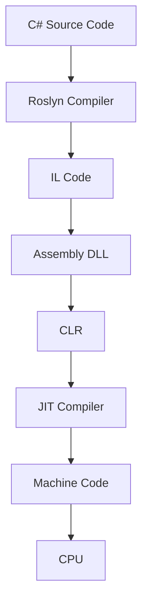

# How C# Works Internally
## From C# Code → IL → CLR → JIT → Machine Code (Complete Deep Dive)

> **Interview Level:** ⭐⭐⭐⭐⭐
>
> This is one of the most frequently asked questions in senior .NET interviews.
>
> Interviewers want to know what happens **after you press the "Run" button**.

---

# Table of Contents

1. Goal
2. Why .NET was created
3. Traditional Languages
4. C# Compilation Process
5. IL (Intermediate Language)
6. CLR
7. JIT Compiler
8. Machine Code
9. Execution Flow
10. Memory Management
11. Garbage Collection
12. Complete Lifecycle
13. Real Production Example
14. Interview Questions

---

# Goal

Let's understand what happens when you write

```csharp
Console.WriteLine("Hello World");
```

Does Windows understand C#?

**No.**

CPU only understands

```
Machine Code

(Binary)

10101010...
```

So how does C# run?

---

# The Problem

Imagine you wrote

```csharp
int a = 10;

int b = 20;

Console.WriteLine(a + b);
```

Question

Can CPU execute this?

```
No
```

CPU understands only

```
Machine Instructions

MOV

ADD

JMP

CALL
```

It has no idea what

```
Console.WriteLine()
```

means.

---

# Traditional Languages (C/C++)

In C++

```
C++ Code

↓

Compiler

↓

Machine Code (.exe)

↓

CPU
```

Example

```
main.cpp

↓

gcc

↓

main.exe

↓

Windows CPU
```

Problem

```
Windows EXE

will not run

on Linux.
```

Need separate compilation.

---

# Microsoft's Solution

Microsoft introduced

```
.NET
```

Instead of compiling directly to Machine Code,

compile to

```
Intermediate Language

(IL)
```

Then

```
Runtime

↓

Machine Code
```

This makes .NET portable across supported platforms.

---

# Complete Flow

```text
C# Code

↓

C# Compiler (Roslyn)

↓

IL (Intermediate Language)

↓

Assembly (.dll/.exe)

↓

CLR

↓

JIT Compiler

↓

Machine Code

↓

CPU Execution
```

---

# Step 1 - Write C# Code

Example

```csharp
class Program
{
    static void Main()
    {
        Console.WriteLine("Hello");
    }
}
```

This is called

```
Source Code
```

File

```
Program.cs
```

---

# Step 2 - Roslyn Compiler

When you build the project

```
dotnet build
```

Roslyn Compiler starts.

Responsibilities

- Syntax checking
- Type checking
- Reference resolution
- Compile C#
- Generate IL

---

# What Roslyn Does

Checks

```
Missing Semicolon

Unknown Variable

Wrong Types

Missing Namespace

Syntax Errors
```

If successful

↓

Generates

```
IL
```

---

# Step 3 - Intermediate Language (IL)

This is the most important concept.

IL

means

```
Intermediate Language
```

Also called

```
MSIL

or

CIL
```

It is

```
NOT

Machine Code
```

It is

CPU-independent instructions.

---

# Why IL?

Suppose

Windows

Linux

macOS

All have different CPUs.

Instead of creating

```
Windows EXE

Linux EXE

Mac EXE
```

Microsoft generates

One

```
IL
```

Later

CLR converts IL

for that operating system.

---

# Example

Your C#

```csharp
int x = 10;

int y = 20;

Console.WriteLine(x+y);
```

becomes

something like

```il
ldc.i4.s 10

stloc.0

ldc.i4.s 20

stloc.1

ldloc.0

ldloc.1

add

call WriteLine
```

Notice

Still

NOT Machine Code.

---

# Step 4 - Assembly

IL is stored inside

```
DLL

or

EXE
```

Example

```
Banking.dll
```

Inside DLL

```
IL Code

+

Metadata

+

Manifest
```

---

# What is Metadata?

Metadata describes

```
Classes

Methods

Interfaces

Properties

References

Attributes
```

Reflection uses Metadata.

---

# What is Manifest?

Assembly information.

Contains

```
Assembly Name

Version

Culture

Referenced DLLs

Security
```

---

# Step 5 - CLR Starts

Now user runs

```
dotnet Banking.dll
```

CLR starts.

CLR

means

```
Common Language Runtime
```

Think of CLR as

```
Operating System

for

.NET
```

---

# What Does CLR Do?

Responsibilities

- Load Assembly
- Verify IL
- Security Checks
- JIT Compilation
- Memory Management
- Exception Handling
- Thread Management
- Garbage Collection

CLR is the heart of .NET.

---

# Step 6 - Assembly Loader

CLR first loads

```
Banking.dll
```

Checks

```
Dependencies

Version

Metadata

Manifest
```

If missing DLL

Application crashes.

---

# Step 7 - Verification

CLR verifies

```
IL

is safe.
```

Checks

```
Invalid Memory Access

Type Safety

Security
```

Unlike C++,

random memory access isn't allowed.

---

# Step 8 - JIT Compiler

This is another important topic.

JIT

means

```
Just-In-Time Compiler
```

Question

Why not convert all IL to Machine Code immediately?

Because

Maybe

```
1000 Methods

exist

Only

20 Methods

are used.
```

Why waste time compiling all?

Instead

Compile

only when needed.

---

# Internal Working

Suppose

Main()

starts.

CLR asks

```
Machine Code exists?
```

No.

Compile.

Store.

Execute.

---

Second call

```
Machine Code

already exists.
```

Reuse.

No recompilation.

---

# Example

```csharp
Add();

Add();

Add();
```

First call

```
IL

↓

Machine Code
```

Second call

```
Machine Code

already available.
```

Fast.

---

# JIT Types

## Normal JIT

Compile methods

when first used.

Most common.

---

## Precompiled (ReadyToRun)

Compile ahead of execution.

Faster startup.

Used for production deployments where startup matters.

---

## Native AOT

Compile directly to native machine code during publish.

- Very fast startup
- Lower memory
- No JIT at runtime

Useful for:

- Microservices
- Console tools
- Serverless

---

# Step 9 - Machine Code

Finally

CPU understands

```
MOV

CALL

ADD

SUB

PUSH

POP
```

Now

CPU executes

the instructions.

---

# Execution Flow



---

# Memory Allocation

Suppose

```csharp
Customer c = new Customer();
```

CLR allocates

Heap Memory.

Reference

stored

inside Stack.

```
Stack

↓

Reference

↓

Heap

↓

Customer Object
```

---

# Garbage Collection

Later

```csharp
c = null;
```

Object

becomes

Unreachable.

Garbage Collector

removes

unused memory.

Automatically.

---

# Exception Handling

Suppose

```csharp
int x = 10 / 0;
```

CLR catches

```
DivideByZeroException
```

Creates Exception Object.

Transfers control

to

Catch Block.

---

# Thread Management

Suppose

```csharp
Task.Run(...)
```

CLR

uses

ThreadPool

instead of creating

new thread

every time.

---

# Real Banking Example

Customer transfers money.

Flow

```text
TransferMoney()

↓

Roslyn

↓

IL

↓

Banking.dll

↓

CLR

↓

JIT

↓

Machine Code

↓

CPU

↓

SQL Server

↓

Response
```

---

# Complete Internal Lifecycle

```text
Developer writes C#

↓

Roslyn Compiler

↓

IL Generated

↓

DLL Created

↓

CLR Loads DLL

↓

Metadata Read

↓

Verification

↓

JIT Compiles Method

↓

Machine Code Generated

↓

CPU Executes

↓

Heap Allocations

↓

Garbage Collection

↓

Program Ends
```

---

# Interview Questions

## Beginner

### What is IL?

Intermediate Language generated by the C# compiler.

It is platform-independent.

---

### What is CLR?

The execution engine of .NET.

Responsible for executing managed code.

---

### What is JIT?

Just-In-Time Compiler.

Converts IL into native machine code at runtime.

---

## Intermediate

### Why not compile directly to Machine Code?

Because IL enables platform independence and runtime services such as verification, security, and JIT optimizations.

---

### What is inside a DLL?

- IL Code
- Metadata
- Manifest
- Resources

---

### Who manages memory?

CLR.

Using

Garbage Collector.

---

## Senior (10+ Years)

### Question

Explain the complete lifecycle of a C# application.

### Expected Answer

```
Developer writes C#

↓

Roslyn Compiler

↓

IL

↓

Assembly (.dll/.exe)

↓

CLR loads Assembly

↓

Reads Metadata

↓

Verifies IL

↓

JIT Compiles Methods

↓

Machine Code

↓

CPU Executes

↓

CLR manages Heap

↓

Garbage Collector reclaims unused memory
```

---

### Question

Why is JIT better than compiling every method at startup?

### Expected Answer

JIT compiles methods only when they are first invoked, reducing startup time and avoiding compilation of methods that are never executed. Compiled native code is cached for subsequent calls within the process.

---

### Question

Difference between IL and Machine Code?

| IL | Machine Code |
|----|--------------|
| Platform Independent | Platform Specific |
| Generated by Roslyn | Generated by JIT/AOT |
| Human-readable with tools like ILDasm | Binary instructions |
| Cannot execute directly | Executed by CPU |

---

### Question

What are the responsibilities of CLR?

**Expected Answer**

- Assembly Loading
- Type Verification
- JIT Compilation
- Garbage Collection
- Memory Management
- Exception Handling
- Thread Management
- Security
- Interoperability
- Runtime Services

---

# Easy Analogy

Imagine you're traveling to different countries.

- **C# Source Code** = English instructions.
- **IL** = A universal language understood by translators.
- **CLR** = The local guide.
- **JIT Compiler** = The translator who converts the universal language into the local language.
- **Machine Code** = The language the local workers (CPU) actually understand.

This is why the same C# code can run on different operating systems with the appropriate .NET runtime.

---

# One-Line Interview Answer

> **C# code is compiled by the Roslyn compiler into Intermediate Language (IL), packaged into an assembly (.dll/.exe), loaded by the CLR, verified for safety, JIT-compiled into native machine code when methods are first executed, and then run by the CPU while the CLR manages memory, exceptions, threading, and garbage collection.**