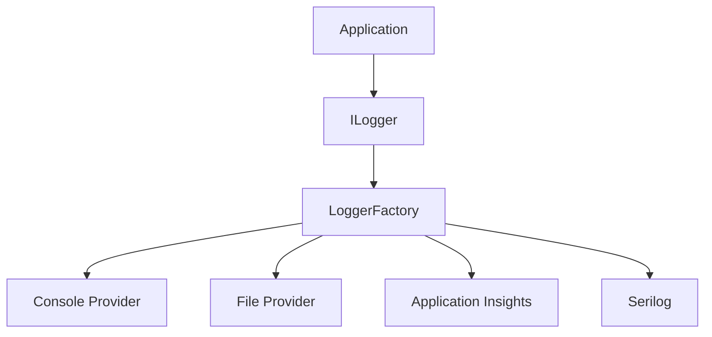

# Logger Implementation in .NET
## Complete Guide (Beginner → Architect | 10+ Years Experience)

> **Interview Level:** ⭐⭐⭐⭐⭐
>
> Logging is one of the most important aspects of any production application.
>
> Companies like:
>
> - Microsoft
> - Amazon
> - UBS
> - Goldman Sachs
> - JP Morgan
> - Netflix
>
> expect candidates to know:
>
> - Why logging is needed
> - How ILogger works internally
> - How logs are written
> - How logs reach Azure Application Insights
> - Structured Logging
> - Correlation IDs
> - Best Practices

---

# Table of Contents

1. Goal
2. Why Logging?
3. Problems Without Logging
4. What is ILogger?
5. Internal Working
6. Logging Levels
7. C# Implementation
8. Structured Logging
9. Correlation ID
10. Logging Providers
11. Azure Application Insights
12. Serilog
13. Performance
14. Best Practices
15. Common Mistakes
16. Interview Questions

---

# Goal

Imagine you deployed your Banking API.

One day

Customer calls support.

```
Money transferred

But receiver didn't receive it.
```

Question

How will you investigate?

Without logs

You have no idea.

With logs

You can see

- API called
- User
- Amount
- SQL executed
- Exception
- Response Time

---

# What is Logging?

Logging means

Recording important events

that occur while the application is running.

Example

```
Application Started

User Logged In

Payment Success

Payment Failed

Database Timeout

Exception

API Response Time
```

---

# Why Logging?

Without logs

Production issue

↓

No clue

↓

Guesswork

↓

Long downtime

With logs

↓

Find root cause quickly.

---

# Real-World Analogy

Think of a CCTV camera.

Without CCTV

You don't know what happened.

With CCTV

You replay events.

Logs are the CCTV footage of your application.

---

# What is ILogger?

`ILogger<T>` is the built-in logging abstraction in ASP.NET Core.

It provides a common API for writing logs without tying your code to a specific logging framework.

Example

```csharp
public class PaymentService
{
    private readonly ILogger<PaymentService> _logger;

    public PaymentService(ILogger<PaymentService> logger)
    {
        _logger = logger;
    }
}
```

Notice

Service doesn't know

whether logs go to

- Console
- File
- Azure
- Serilog
- Application Insights

Only

ILogger.

---

# Internal Working

Suppose

```csharp
_logger.LogInformation("Payment Started");
```

Internally

```text
Payment Service

↓

ILogger

↓

Logger Factory

↓

Logging Provider

↓

Console/File/Application Insights

↓

Log Stored
```

---

# Architecture



---

# Logging Levels

| Level | Use Case |
|---------|----------|
| Trace | Very detailed debugging |
| Debug | Developer debugging |
| Information | Normal application flow |
| Warning | Unexpected but recoverable situation |
| Error | Operation failed |
| Critical | Application may stop working |

---

# Example

```csharp
_logger.LogTrace("Method entered");

_logger.LogDebug("SQL Query Started");

_logger.LogInformation("Order Created");

_logger.LogWarning("Retrying Payment");

_logger.LogError(ex, "Payment Failed");

_logger.LogCritical("Database Offline");
```

---

# Production Example

Order Processing

```csharp
public async Task PlaceOrder(Order order)
{
    _logger.LogInformation(
        "Order creation started. OrderId={OrderId}",
        order.Id);

    try
    {
        await _repository.Save(order);

        _logger.LogInformation(
            "Order created successfully. OrderId={OrderId}",
            order.Id);
    }
    catch(Exception ex)
    {
        _logger.LogError(
            ex,
            "Failed to create Order. OrderId={OrderId}",
            order.Id);

        throw;
    }
}
```

---

# Why Pass Exception?

Wrong

```csharp
_logger.LogError("Something failed");
```

Correct

```csharp
_logger.LogError(ex,
    "Payment Failed");
```

Now

Log contains

- Stack Trace
- Message
- Inner Exception

---

# Structured Logging

One of the most important interview topics.

Wrong

```csharp
_logger.LogInformation(
"Customer " + id + " created");
```

Correct

```csharp
_logger.LogInformation(
"Customer created. CustomerId={CustomerId}",
id);
```

---

# Why Structured Logging?

Because tools like

- Serilog
- Application Insights
- Elasticsearch

can search

```
CustomerId

=

1001
```

Very easily.

---

# Example Log

```json
{
 "message":"Customer created",
 "CustomerId":1001,
 "ElapsedMs":25
}
```

Instead of

```
Customer created 1001
```

---

# Correlation ID

Suppose

Request

passes through

```
API

↓

Order Service

↓

Payment

↓

Notification

↓

Inventory
```

Need

one ID

to track

entire request.

Example

```
CorrelationId

abc123
```

Every log contains

```
abc123
```

Now

entire request

is traceable.

---

# Flow

```text
Client

↓

API

↓

Order Service

↓

Payment Service

↓

Inventory

↓

Email
```

All logs

contain

same Correlation ID.

---

# Logging Providers

ASP.NET Core supports

- Console
- Debug
- Event Source
- Azure Application Insights

Third-party

- Serilog
- NLog
- log4net

---

# Logger Factory

Registration

```csharp
builder.Logging.ClearProviders();

builder.Logging.AddConsole();

builder.Logging.AddApplicationInsights();
```

ILogger

doesn't know

where logs go.

Factory decides.

---

# Azure Application Insights

Flow

```text
Application

↓

ILogger

↓

Application Insights SDK

↓

Azure

↓

Portal

↓

Search Logs
```

You can search

- Exceptions
- Dependencies
- SQL
- HTTP
- Performance
- Custom Events

---

# Serilog

Popular production logger.

Supports

- Console
- File
- SQL
- Elasticsearch
- Seq
- Azure Blob
- Application Insights

Example

```csharp
Log.Information(
"Payment Success. PaymentId={PaymentId}",
paymentId);
```

---

# Performance

Bad

```csharp
_logger.LogInformation(
$"Customer {customer.Name}");
```

String interpolation executes

even if

Information logging

is disabled.

---

Good

```csharp
_logger.LogInformation(
"Customer {CustomerName}",
customer.Name);
```

Formatting happens only when the log is actually written.

---

# Custom Logger

Example

```csharp
public class DatabaseLogger : ILogger
{
    public IDisposable BeginScope<TState>(TState state)
        => default!;

    public bool IsEnabled(LogLevel logLevel)
        => true;

    public void Log<TState>(
        LogLevel logLevel,
        EventId eventId,
        TState state,
        Exception? exception,
        Func<TState, Exception?, string> formatter)
    {
        Console.WriteLine(formatter(state, exception));

        // Save to DB/File/etc.
    }
}
```

Normally

You create

Logger Provider

instead of

ILogger directly.

---

# Logger Lifetime

Question

What lifetime is ILogger?

Answer

```
Singleton Infrastructure
```

The logging infrastructure is registered once and shared.

`ILogger<T>`

is lightweight

and resolved

through

`ILoggerFactory`.

---

# Best Practices

- Use Structured Logging.
- Log Exceptions with stack trace.
- Use Correlation IDs.
- Never log passwords.
- Never log OTPs.
- Never log JWT tokens.
- Log business events.
- Log execution time.
- Use appropriate log levels.
- Centralize logs.

---

# Common Mistakes

## ❌ Logging Sensitive Data

Wrong

```text
Password

Credit Card

JWT

API Key
```

Never.

---

## ❌ Logging Everything as Error

Information

is not Error.

Choose

correct level.

---

## ❌ Swallowing Exceptions

Wrong

```csharp
catch(Exception)
{
}
```

Always

log

before rethrowing or handling.

---

## ❌ Using Console.WriteLine()

Never

for production.

Use ILogger.

---

# Production Architecture

```text
Client

↓

API

↓

ILogger

↓

Logger Factory

↓

Application Insights

↓

Azure Portal

↓

Dashboard

↓

Alerts
```

---

# Logging + Distributed System

```text
API

↓

Service Bus

↓

Inventory

↓

Payment

↓

Email
```

Every service

logs

```
CorrelationId

OrderId

CustomerId
```

Tracing becomes easy.

---

# Real Banking Example (UBS)

Money Transfer

```
Transfer Started

↓

Balance Checked

↓

Debit Success

↓

Credit Success

↓

Notification Sent

↓

Transfer Completed
```

If

Credit fails

Log contains

```
TransactionId

CustomerId

SQL Error

Duration

Exception
```

Easy debugging.

---

# Common Interview Questions

## Beginner

### What is ILogger?

Built-in logging abstraction in ASP.NET Core.

---

### Why ILogger instead of Console.WriteLine()?

ILogger supports

- Levels
- Multiple providers
- Structured logging
- Production monitoring

---

### What are logging levels?

Trace

Debug

Information

Warning

Error

Critical

---

## Intermediate

### What is Structured Logging?

Logging named properties instead of concatenated strings.

Example

```csharp
_logger.LogInformation(
"Order {OrderId} created",
orderId);
```

---

### What is Correlation ID?

A unique identifier used to trace one request across multiple services.

---

### Why use Logger Factory?

It allows switching logging providers without changing application code.

---

## Senior (10+ Years)

### Question

Explain the internal working of ILogger.

### Expected Answer

```
Application

↓

ILogger<T>

↓

ILoggerFactory

↓

Configured Providers

↓

Application Insights

↓

Azure Storage/File/Console
```

---

### Question

How would you implement logging in a Microservice Architecture?

### Expected Answer

- Structured Logging
- Correlation ID
- Centralized Logging
- Application Insights
- Distributed Tracing
- Log Aggregation
- Alerts

---

### Question

Why shouldn't you use string interpolation in logging?

### Expected Answer

Because interpolation builds the string even when the log level is disabled. Parameterized logging defers formatting until needed and preserves structured properties.

---

### Question

What information should never be logged?

- Passwords
- Credit Card Numbers
- OTPs
- JWT Tokens
- API Keys
- Connection Strings
- Sensitive Personal Information

---

### Question

How do you debug a production issue using logs?

### Expected Answer

1. Search by Correlation ID.
2. Check exceptions.
3. Review dependency calls (SQL, HTTP).
4. Measure execution time.
5. Inspect request flow across services.
6. Use Application Insights distributed tracing.

---

# Easy Analogy

Imagine an airport.

Every passenger movement is recorded.

```
Entered Airport

↓

Security Check

↓

Boarding

↓

Flight

↓

Destination
```

If something goes wrong,

security reviews CCTV.

Similarly,

logs record every important application event, helping engineers investigate issues.

---

# One-Line Interview Answer

> **ILogger is the built-in logging abstraction in ASP.NET Core that writes structured, level-based logs through configurable providers such as Console, Serilog, or Azure Application Insights, enabling centralized monitoring, debugging, and distributed tracing without coupling application code to a specific logging framework.**