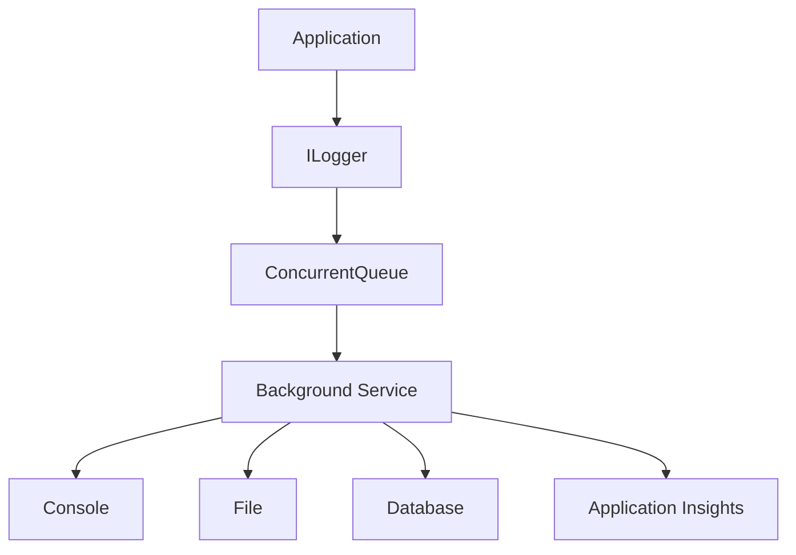

# Design a Logger in C#
## Low-Level Design (LLD) | Beginner → Architect | 10+ Years Experience

> **Interview Level:** ⭐⭐⭐⭐⭐
>
> This is a very common LLD interview question.
>
> Interviewers usually ask:
>
> - Design a Logger
> - How will you support Console, File, Database logging?
> - How will you make it extensible?
> - How will you make it thread-safe?
> - How will you make it asynchronous?

---

# Goal

Design a logging framework that can support multiple outputs like:

- Console
- File
- Database
- Azure Application Insights
- Elasticsearch
- Splunk

Without changing existing code.

---

# Functional Requirements

The logger should support:

- Multiple log levels
- Multiple log providers
- Structured logging
- Thread-safe logging
- Easy extensibility
- Dependency Injection

---

# Non-Functional Requirements

- High Performance
- Thread Safe
- Non-blocking
- Extensible
- Low Memory Usage

---

# Step 1 - Define Log Levels

```csharp
public enum LogLevel
{
    Trace,
    Debug,
    Information,
    Warning,
    Error,
    Critical
}
```

---

# Step 2 - Log Model

```csharp
public class LogMessage
{
    public DateTime TimeStamp { get; set; }

    public LogLevel Level { get; set; }

    public string Message { get; set; } = string.Empty;

    public Exception? Exception { get; set; }
}
```

---

# Step 3 - Create Logger Interface

```csharp
public interface ILogger
{
    void Log(LogMessage message);
}
```

Why?

Because tomorrow you may have

- ConsoleLogger
- FileLogger
- DatabaseLogger

The application should not know the implementation.

---

# Step 4 - Console Logger

```csharp
public class ConsoleLogger : ILogger
{
    public void Log(LogMessage message)
    {
        Console.WriteLine(
            $"[{message.TimeStamp}] " +
            $"[{message.Level}] " +
            $"{message.Message}");
    }
}
```

---

# Step 5 - File Logger

```csharp
public class FileLogger : ILogger
{
    private readonly string _path;

    public FileLogger(string path)
    {
        _path = path;
    }

    public void Log(LogMessage message)
    {
        File.AppendAllText(
            _path,
            $"[{message.TimeStamp}] " +
            $"[{message.Level}] " +
            $"{message.Message}{Environment.NewLine}");
    }
}
```

---

# Step 6 - Database Logger

```csharp
public class DatabaseLogger : ILogger
{
    public void Log(LogMessage message)
    {
        // Insert into Log table
        Console.WriteLine("Saving log into database...");
    }
}
```

---

# Architecture

```text
                 Application

                      │

                      ▼

                 ILogger

        ┌─────────┼──────────┐

        ▼         ▼          ▼

 ConsoleLogger FileLogger DatabaseLogger
```

---

# Step 7 - Logger Factory

Instead of

```csharp
new ConsoleLogger();
```

Use Factory Pattern.

```csharp
public static class LoggerFactory
{
    public static ILogger Create(string type)
    {
        return type switch
        {
            "Console" => new ConsoleLogger(),
            "File" => new FileLogger("app.log"),
            "Database" => new DatabaseLogger(),
            _ => throw new Exception("Invalid Logger")
        };
    }
}
```

Usage

```csharp
ILogger logger =
    LoggerFactory.Create("Console");

logger.Log(new LogMessage
{
    Level = LogLevel.Information,
    Message = "Application Started",
    TimeStamp = DateTime.Now
});
```

---

# Problem with Current Design

Suppose you want

Console + File

Current design

supports

only

one logger.

Need improvement.

---

# Step 8 - Composite Logger

```csharp
public class CompositeLogger : ILogger
{
    private readonly IEnumerable<ILogger> _loggers;

    public CompositeLogger(IEnumerable<ILogger> loggers)
    {
        _loggers = loggers;
    }

    public void Log(LogMessage message)
    {
        foreach (var logger in _loggers)
        {
            logger.Log(message);
        }
    }
}
```

Now

One log

goes to

- Console
- File
- Database

simultaneously.

---

# Internal Flow

```text
Application

↓

Composite Logger

↓

Console

↓

File

↓

Database

↓

Application Insights
```

---

# Step 9 - Thread Safety

Imagine

1000 users

calling

```csharp
logger.Log()
```

simultaneously.

Problem

```
Two threads

write

same file.

↓

Corrupted Log
```

Solution

```csharp
private readonly object _lock = new();

public void Log(LogMessage message)
{
    lock (_lock)
    {
        File.AppendAllText(...);
    }
}
```

For very high throughput, a background queue is usually preferred over locking every write.

---

# Step 10 - Asynchronous Logger

Production systems

don't write

directly

to disk.

Instead

```text
Application

↓

Queue

↓

Background Worker

↓

File
```

Example

```csharp
ConcurrentQueue<LogMessage>

↓

BackgroundService

↓

Save Log
```

Benefits

- Faster API response
- No blocking
- High throughput

---

# Step 11 - Background Worker

```csharp
while(true)
{
    if(queue.TryDequeue(out var log))
    {
        Save(log);
    }
}
```

In ASP.NET Core, this is typically implemented using a `BackgroundService`.

---

# Better Production Design



---

# Structured Logging

Instead of

```csharp
"User 1001 Logged In"
```

Store

```json
{
   "UserId":1001,
   "Action":"Login",
   "Time":"2026-07-25"
}
```

Much easier to search.

---

# Logging Levels

```text
Trace

↓

Debug

↓

Information

↓

Warning

↓

Error

↓

Critical
```

Logger checks

```text
Current Level

↓

Should Write?

↓

Yes

↓

Save
```

---

# Filtering

```csharp
if(message.Level < LogLevel.Warning)
    return;
```

Only Warning

Error

Critical

are stored.

---

# Production Features

A real logging framework should support

- Log Rotation
- Log Compression
- Retry
- Structured Logging
- Correlation IDs
- Async Logging
- Multiple Providers
- Configuration
- Log Retention

---

# Design Patterns Used

| Pattern | Why |
|----------|-----|
| Factory | Create loggers |
| Strategy | Different logging providers |
| Composite | Multiple loggers together |
| Singleton | LoggerFactory / configuration |
| Dependency Injection | Resolve ILogger |

---

# Performance

| Approach | Performance |
|-----------|-------------|
| Console.WriteLine | Slow |
| File Write (Sync) | Medium |
| Database Insert | Slow |
| Async Queue | Fast |
| Batch Logging | Fastest |

---

# Common Mistakes

## ❌ Writing directly to database

Every request

↓

Database

↓

Performance issue.

Instead

Queue

↓

Batch insert.

---

## ❌ Using lock everywhere

Too much locking

reduces throughput.

---

## ❌ Logging every variable

Logs become

Huge

Expensive

Unreadable.

---

## ❌ Logging passwords

Never log

- Password
- OTP
- JWT
- API Keys
- Credit Card Number

---

# Best Practices

- Use asynchronous logging.
- Use structured logging.
- Use log levels correctly.
- Use Correlation IDs.
- Batch writes where possible.
- Use rolling log files.
- Centralize logs (Application Insights, Elasticsearch, Splunk).

---

# Real Banking Example

Money Transfer

```text
API

↓

Logger

↓

Queue

↓

Background Worker

↓

Application Insights

↓

Azure Dashboard
```

Even if

Application Insights

is temporarily slow,

API

doesn't wait.

---

# Interview Questions

## Beginner

### What is ILogger?

An abstraction for writing logs without depending on a specific logging provider.

---

### Why use an interface?

To support multiple logger implementations and loose coupling.

---

### Why Factory Pattern?

To centralize object creation and hide implementation details.

---

## Intermediate

### How would you support multiple log destinations?

Use the Composite Pattern to call multiple `ILogger` implementations.

---

### Why use asynchronous logging?

To avoid blocking the main request thread during slow I/O operations.

---

### How do you make file logging thread-safe?

Use synchronization (e.g., `lock`) or, preferably, a single background writer processing a queue.

---

## Senior (10+ Years)

### Question

Design a scalable logger for 1 million log entries per minute.

### Expected Answer

```
Application

↓

ILogger

↓

Concurrent Queue / Channel

↓

Background Workers

↓

Batch Processing

↓

Application Insights

↓

Blob Storage / Elasticsearch
```

Use batching, asynchronous processing, retry policies, and backpressure handling.

---

### Question

How would you avoid losing logs if the application crashes?

### Expected Answer

- Use durable queues where appropriate.
- Flush buffered logs during graceful shutdown.
- Batch frequently.
- Retry transient failures.
- Use centralized logging platforms.

---

### Question

How would you design a pluggable logger?

### Expected Answer

- Define `ILogger`.
- Implement providers (Console, File, Database, Azure).
- Register implementations using Dependency Injection.
- Use Composite Pattern for multiple providers.
- Configure providers via configuration files.

---

### Question

How would you reduce logging overhead?

### Expected Answer

- Filter by log level.
- Use asynchronous logging.
- Batch writes.
- Avoid expensive string interpolation.
- Use structured logging.
- Sample high-volume logs when appropriate.

---

# Easy Analogy

Imagine a newspaper printing press.

- **Application** → Reporter writing news.
- **ILogger** → Editor receiving news.
- **Composite Logger** → Editor sending the same story to multiple newspapers.
- **Queue** → Stack of articles waiting to be printed.
- **Background Worker** → Printing machine.
- **Console/File/Application Insights** → Different newspapers publishing the story.

The reporter doesn't care where the news is published; they simply submit the story.

---

# One-Line Interview Answer

> **A production-quality logger should be built around an `ILogger` abstraction, use the Factory and Composite patterns for extensibility, support asynchronous queue-based processing, structured logging, multiple providers, correlation IDs, and thread-safe, non-blocking log persistence.**