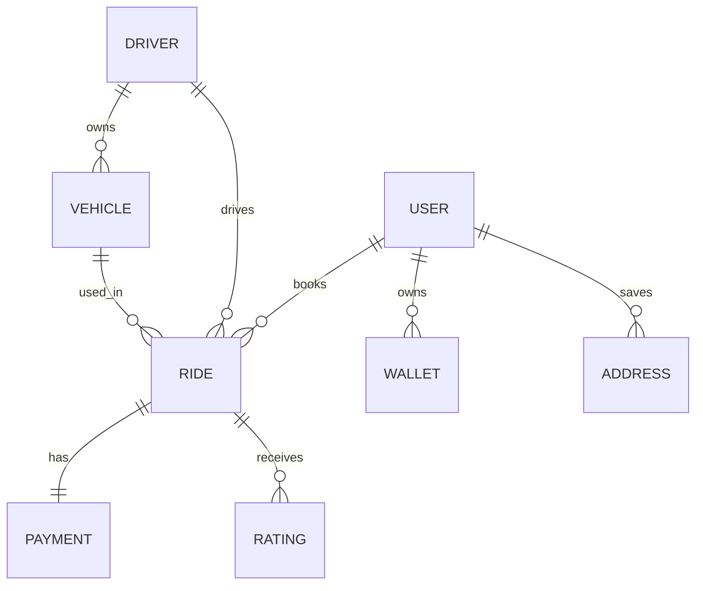

# Uber System LLD - Step 1: Database Design
## How to Think Like a Senior Engineer (10+ Years Experience)

> **Important**
>
> Before writing a single line of code, senior engineers spend significant time on **data modeling**.
>
> A well-designed database can make the application scalable, maintainable, and performant.
>
> A poorly designed database leads to:
>
> - Slow queries
> - Duplicate data
> - Complex joins
> - Deadlocks
> - Data inconsistency
> - Scaling problems

---

# Goal

In this step, we will **ONLY focus on Database Design**.

We will NOT discuss:

- API
- Services
- Kafka
- Redis
- Microservices
- Kubernetes

We'll design the database exactly as a senior architect would.

---

# Step 1 - Understand the Business

Never start with tables.

Start with business questions.

Ask yourself:

> What are the nouns in the business?

For Uber

```
User

Driver

Vehicle

Ride

Location

Payment

Coupon

Rating

Trip

Invoice

Wallet

Promo

Notification
```

Every noun generally becomes an Entity.

---

# Step 2 - Identify Main Entities

First identify independent entities.

```
User

Driver

Vehicle

Ride

Payment
```

Don't think about relationships yet.

---

# Step 3 - Identify Relationships

Now ask

```
One User

↓

How many rides?
```

Many

Therefore

```
User

1

↓

Many Rides
```

---

Another

```
One Driver

↓

Many rides?
```

Yes

```
Driver

1

↓

Many Rides
```

---

Vehicle

```
One Driver

↓

One Vehicle?
```

Business says

One active vehicle.

Relationship

```
Driver

1

↓

1 Vehicle
```

Later Uber allows

Multiple vehicles

Relationship becomes

```
Driver

1

↓

Many Vehicles
```

Notice

Database design changes according to business.

---

# Step 4 - Normalize

Bad Design

```
Ride

CustomerName

CustomerPhone

DriverName

DriverPhone
```

Duplicate.

Instead

```
Ride

CustomerId

DriverId
```

Normalize.

---

# Final ER Diagram



---

# Entity 1 - User

Represents customer.

```
User
```

| Column | Type | Reason |
|---------|------|--------|
| UserId | bigint PK | Internal Id |
| FirstName | nvarchar(100) | |
| LastName | nvarchar(100) | |
| Email | nvarchar | Login |
| Mobile | nvarchar | OTP |
| Status | tinyint | Active/Suspended |
| CreatedAt | datetime2 | Audit |
| UpdatedAt | datetime2 | Audit |

---

## Why bigint?

Uber may have

```
Millions

↓

Billions

↓

Trillions
```

Avoid INT exhaustion.

---

Indexes

```
PK(UserId)

UNIQUE Email

UNIQUE Mobile
```

---

# Entity 2 - Driver

Driver is NOT User.

Reason

Different lifecycle.

Different KYC.

Different documents.

Different status.

```
Driver
```

| Column | Type |
|----------|------|
| DriverId |
| Name |
| Mobile |
| LicenseNo |
| Aadhaar |
| Status |
| CurrentLatitude |
| CurrentLongitude |
| Rating |

---

Question

Should Current Latitude be stored?

Answer

Depends.

Production

Usually

No.

Store inside

Redis

or

Geo database.

Reason

Driver location changes every few seconds.

Database cannot handle

100 million updates/day efficiently.

Instead

SQL stores

Last Known Location

or

Historical Trips.

---

# Entity 3 - Vehicle

```
Vehicle
```

| Column | Purpose |
|----------|----------|
| VehicleId | PK |
| DriverId | FK |
| VehicleNumber | Unique |
| Type | Sedan/SUV |
| Model | Swift |
| Brand | Maruti |
| Color | White |
| RCNumber | Unique |
| InsuranceExpiry | |

---

Relationship

```
Driver

1

↓

Many Vehicles
```

Production

Need

```
IsActive
```

Only one active.

---

# Entity 4 - Ride

Most important table.

```
Ride
```

| Column | Reason |
|---------|--------|
| RideId | PK |
| UserId | FK |
| DriverId | FK |
| VehicleId | FK |
| PickupLatitude |
| PickupLongitude |
| DropLatitude |
| DropLongitude |
| Status |
| EstimatedFare |
| ActualFare |
| Distance |
| Duration |
| RequestedTime |
| AcceptedTime |
| StartedTime |
| CompletedTime |

---

Why timestamps?

Need

Ride Analytics

Average pickup time

Average trip duration

Driver efficiency

---

Indexes

```
RideId PK

DriverId

UserId

Status

RequestedTime
```

---

# Should Pickup Address be Stored?

Store

Coordinates

```
18.5204

73.8567
```

NOT

```
Baner Road Pune
```

Address changes.

Coordinates don't.

Display address

Generated later.

---

# Ride Status

Never

Boolean.

Use enum.

```
Requested

DriverAssigned

Accepted

DriverArriving

Started

Completed

Cancelled

PaymentPending
```

---

# Payment Table

Separate table.

Reason

Payment retry.

Refund.

Partial payment.

```
Payment
```

| Column | Reason |
|----------|----------|
| PaymentId |
| RideId |
| Amount |
| Method |
| Gateway |
| TransactionId |
| Status |

---

Relationship

```
Ride

1

↓

1 Payment
```

Future

Split payment

↓

Many payments.

Database supports change.

---

# Rating

One ride

↓

One customer rating

One driver rating

Better design

```
Rating
```

| Column |
|---------|
| RatingId |
| RideId |
| FromUserId |
| ToUserId |
| Rating |
| Comment |

Supports

Driver

↓

Customer

AND

Customer

↓

Driver

Same table.

---

# Coupon

```
Coupon
```

Stores

```
Code

Discount

Expiry

Type
```

Need bridge table

```
UserCoupon
```

Because

```
One User

↓

Many Coupons

One Coupon

↓

Many Users
```

Many-to-Many.

---

# Wallet

```
Wallet
```

Balance.

Transactions separate.

Never store only balance.

Need

```
WalletTransaction
```

Reason

Audit.

---

# Address

Users save

```
Home

Office

Airport
```

One user

↓

Many addresses.

---

# Audit Columns

Every table.

```
CreatedBy

CreatedDate

UpdatedBy

UpdatedDate

IsDeleted

Version(RowVersion)
```

Mandatory.

---

# Soft Delete

Never

DELETE

Driver.

Instead

```
IsDeleted=1
```

Reason

History.

Auditing.

---

# Concurrency

Need

```
RowVersion
```

Example

Two admins

Update

Driver.

Prevent overwrite.

---

# Complete Relationship

```
User

↓

Ride

↓

Payment

↓

Rating

↓

Invoice
```

Driver

↓

Ride

↓

Vehicle

---

# Index Strategy

User

```
PK

Email

Mobile
```

Ride

```
DriverId

UserId

Status

RequestedTime

CompletedTime
```

Vehicle

```
VehicleNumber

DriverId
```

Payment

```
RideId

TransactionId
```

---

# Tables We Avoid Initially

Don't create

```
DriverAnalytics

RideAnalytics

MonthlyReport
```

These are reporting tables.

Generated later.

---

# Partitioning Strategy

Ride table

Will reach

Billions.

Partition

```
By Month
```

Example

```
Ride_2026_01

Ride_2026_02

Ride_2026_03
```

SQL Server Partition.

---

# What NOT to Store

Don't store

```
Current Driver Location
```

in SQL.

Don't store

```
Current ETA
```

Don't store

```
Current Traffic
```

These belong in

- Redis
- GeoSpatial Store
- Real-time services

---

# Final Database

```
User

Driver

Vehicle

Ride

Payment

Wallet

WalletTransaction

Coupon

UserCoupon

Rating

Address

Invoice
```

---

# How Senior Engineers Think

Instead of asking:

> "What tables do I need?"

Ask these questions:

### 1. What is the business entity?

```
Ride
```

---

### 2. Is it independent?

Yes

Create table.

---

### 3. Does it change frequently?

Yes

Don't store frequently changing values in SQL.

---

### 4. Is it historical?

Yes

Store forever.

---

### 5. Is it transactional?

Yes

ACID.

---

### 6. Is it analytical?

No.

Move later.

---

### 7. Will this table become huge?

Ride

Payment

WalletTransaction

Partition.

---

### 8. What are my top queries?

Example:

```sql
Get active ride by DriverId

Get ride history by UserId

Get payment by RideId

Get available vehicle by DriverId
```

Design indexes **based on queries**, not guesses.

---

# Interview Questions (10+ Years)

### Q1. Why is Driver separated from User?

**Expected Answer**

Although both are people, they have different business lifecycles, KYC requirements, documents, permissions, and operational workflows. Keeping them separate simplifies maintenance and avoids sparse columns.

---

### Q2. Why shouldn't current GPS location be stored in SQL Server?

**Expected Answer**

A driver's location changes every few seconds. Persisting every update in a relational database creates excessive write load, lock contention, index maintenance, and storage growth. Real-time location belongs in an in-memory or geospatial store, while SQL stores historical ride data.

---

### Q3. Why use `BIGINT` instead of `INT`?

**Expected Answer**

Ride-sharing platforms can accumulate billions of records over time. `BIGINT` provides significantly more capacity and avoids future key exhaustion.

---

### Q4. Why normalize Ride and Payment?

**Expected Answer**

Payments have their own lifecycle (authorization, capture, refund, retry, failure). Separating them avoids duplication and supports future business requirements.

---

# Next Step

After the database is finalized, the next logical step is **designing the C# Domain Models (Entities), Navigation Properties, DbContext configuration, and Fluent API mappings**, followed by repositories, services, and the complete LLD.
