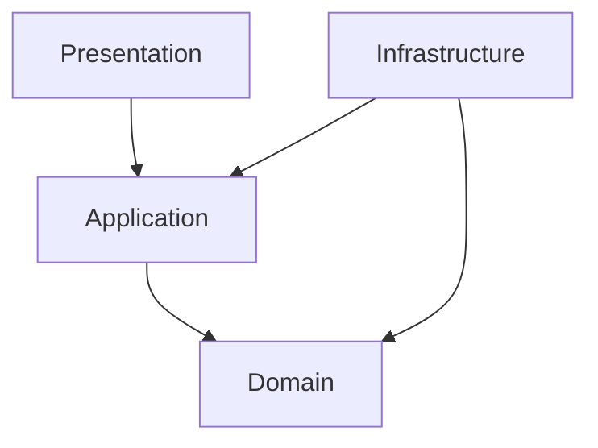
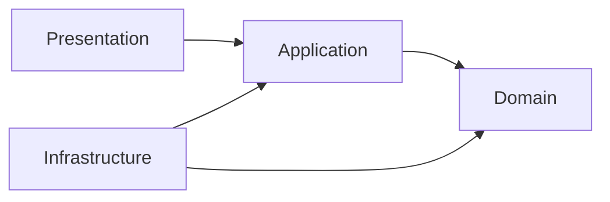

# Onion Architecture Explained
## Complete Guide with Banking Example (.NET / C#)

> **Interview Level:** ⭐⭐⭐⭐⭐
>
> Onion Architecture is one of the most common architectures used in enterprise applications.
>
> Companies like **Microsoft, UBS, Goldman Sachs, JP Morgan, Amazon** use similar layered architectures to build maintainable, testable, and scalable applications.

---

# What is Onion Architecture?

## Definition

Onion Architecture is a software architecture pattern where the **core business logic is placed at the center**, and all external dependencies (Database, UI, APIs, Third-Party Services) depend on the core—not the other way around.

### Golden Rule

> **Dependencies always point inward.**

The Domain layer knows nothing about:

- SQL Server
- Entity Framework
- ASP.NET Core
- Azure
- RabbitMQ
- Redis

---

# Why Does Onion Architecture Exist?

Imagine a banking application.

Without Onion Architecture:

```text
Controller

↓

Entity Framework

↓

SQL Server

↓

Business Logic
```

Problems:

- Business logic depends on EF Core.
- Hard to unit test.
- Changing SQL Server to PostgreSQL affects business logic.
- Controllers become large.
- Tight coupling.

---

# Goal

Keep the business rules independent of external technologies.

---

# Real-World Analogy

Think of an **onion**.

```text
        +----------------------+
        |     Presentation     |
        +----------------------+
        |    Infrastructure    |
        +----------------------+
        |     Application      |
        +----------------------+
        |        Domain        |
        +----------------------+
```

The **Domain** is protected.

Outer layers can change.

Inner layer should remain stable.

---

# Core Principle

```text
Outer Layer

↓

Can depend on

↓

Inner Layer

----------------

Inner Layer

↓

Never depends on

↓

Outer Layer
```

---

# Layers in Onion Architecture



---

# Layer 1 - Domain (Center)

## What is it?

The Domain contains the **business rules**.

It has **no external dependencies**.

---

## Contains

- Entities
- Value Objects
- Domain Services
- Domain Events
- Repository Interfaces
- Enums
- Business Rules

---

### Example

Customer

```csharp
public class Customer
{
    public int Id { get; private set; }

    public string Name { get; private set; }

    public decimal WalletBalance { get; private set; }

    public void AddMoney(decimal amount)
    {
        if (amount <= 0)
            throw new ArgumentException("Amount must be positive.");

        WalletBalance += amount;
    }
}
```

Notice

No EF Core.

No SQL.

No API.

Only business logic.

---

# Layer 2 - Application

## Responsibility

Application layer coordinates business use cases.

It doesn't know how data is stored.

---

Contains

- Services
- Commands
- Queries
- DTOs
- Interfaces
- Validators

---

Example

```csharp
public class WalletService
{
    private readonly ICustomerRepository _repository;

    public WalletService(ICustomerRepository repository)
    {
        _repository = repository;
    }

    public async Task AddMoneyAsync(int customerId, decimal amount)
    {
        var customer = await _repository.GetByIdAsync(customerId);

        customer.AddMoney(amount);

        await _repository.SaveAsync();
    }
}
```

Notice

Uses

```
ICustomerRepository
```

Not EF Core.

---

# Layer 3 - Infrastructure

## Responsibility

Implements technical details.

Contains

- Entity Framework
- SQL Server
- Redis
- RabbitMQ
- Azure Blob
- Email
- Logging

---

Example

```csharp
public class CustomerRepository : ICustomerRepository
{
    private readonly AppDbContext _context;

    public CustomerRepository(AppDbContext context)
    {
        _context = context;
    }

    public async Task<Customer> GetByIdAsync(int id)
    {
        return await _context.Customers.FindAsync(id);
    }

    public async Task SaveAsync()
    {
        await _context.SaveChangesAsync();
    }
}
```

Notice

EF Core stays here.

---

# Layer 4 - Presentation

Contains

- Controllers
- APIs
- gRPC
- GraphQL
- SignalR

Example

```csharp
[ApiController]
public class WalletController : ControllerBase
{
    private readonly WalletService _service;

    public WalletController(WalletService service)
    {
        _service = service;
    }

    [HttpPost]
    public async Task<IActionResult> AddMoney(AddMoneyRequest request)
    {
        await _service.AddMoneyAsync(request.CustomerId, request.Amount);

        return Ok();
    }
}
```

Notice

Controller

↓

Service

↓

Repository

↓

Database

---

# Complete Request Flow

```text
HTTP Request

↓

Controller

↓

Application Service

↓

Repository Interface

↓

Repository Implementation

↓

EF Core

↓

SQL Server

↓

Repository

↓

Service

↓

Controller

↓

Response
```

---

# Folder Structure

```text
BankingSolution

│

├── Banking.Api

│

├── Banking.Application

│

├── Banking.Domain

│

├── Banking.Infrastructure

│

└── Banking.Tests
```

---

# Dependency Flow

```text
Presentation

↓

Application

↓

Domain

Infrastructure

↓

Application

↓

Domain
```

Notice

Domain depends on nobody.

---

# Why Repository Interface is in Domain/Application?

Repository Interface

```csharp
public interface ICustomerRepository
{
    Task<Customer> GetByIdAsync(int id);
}
```

Repository Implementation

```csharp
public class CustomerRepository
```

stays inside

Infrastructure.

Reason

Business shouldn't know

EF Core.

---

# Banking Example

Money Transfer

```
Controller

↓

TransferService

↓

IAccountRepository

↓

AccountRepository

↓

SQL Server
```

Business Rule

```
Balance

Cannot Become Negative
```

belongs in

```
Domain
```

NOT

Controller.

---

# Another Example - Uber

Ride Booking

Presentation

```
RideController
```

↓

Application

```
RideService
```

↓

Domain

```
Ride

Driver

Vehicle
```

↓

Infrastructure

```
RideRepository

EF Core

Redis

Kafka
```

---

# Why Is It Better?

Suppose today

Database

```
SQL Server
```

Tomorrow

```
PostgreSQL
```

Only Infrastructure changes.

Domain remains untouched.

---

# Dependency Injection

```csharp
builder.Services.AddScoped<
    ICustomerRepository,
    CustomerRepository>();

builder.Services.AddScoped<
    WalletService>();
```

Presentation doesn't know implementation details.

---

# Advantages

- Clear Separation of Concerns.
- Highly Testable.
- Easy to replace database.
- Easier maintenance.
- Better scalability.
- Business logic isolated.
- Technology-independent Domain.

---

# Disadvantages

- More projects.
- More interfaces.
- Slight learning curve.
- Overkill for small CRUD applications.

---

# Onion vs Layered Architecture

| Layered Architecture | Onion Architecture |
|----------------------|--------------------|
| Database often at center | Domain at center |
| Business depends on DB | DB depends on business |
| Tighter coupling | Loose coupling |
| Harder to test | Easier to test |
| Technology-centric | Domain-centric |

---

# Onion vs Clean Architecture

| Onion | Clean |
|--------|-------|
| Domain-centric | Use-case-centric |
| Similar dependency rule | Same dependency rule |
| Repository interfaces inside core | Same concept |
| Widely used in .NET | Very popular today |

Many enterprise applications use a hybrid of Onion and Clean Architecture.

---

# Internal Dependency Diagram



---

# Common Mistakes

## ❌ Putting Business Logic in Controller

```csharp
if(balance<0)
```

Wrong.

Should be inside

Domain.

---

## ❌ Domain Using DbContext

Wrong

```csharp
public class Customer
{
    AppDbContext db;
}
```

Domain should never know EF Core.

---

## ❌ Repository Interface inside Infrastructure

Wrong.

Interface belongs to the core (Domain/Application).

Implementation belongs to Infrastructure.

---

## ❌ Calling SQL Directly from Controller

Never.

Always go through the Application layer.

---

# Best Practices

- Keep Domain pure.
- Keep Controllers thin.
- Keep Infrastructure replaceable.
- Use Dependency Injection.
- Place business rules in Domain entities/services.
- Keep external libraries out of the Domain layer.
- Use CQRS when the application grows.

---

# Production Example (UBS Banking)

### Domain

- Account
- Customer
- Transaction
- MoneyTransfer Rules

### Application

- TransferMoneyCommand
- WalletService
- NotificationService

### Infrastructure

- SQL Server
- Azure Service Bus
- Redis
- EF Core

### Presentation

- REST APIs
- Internal APIs
- Batch Jobs

---

# Interview Questions

## Beginner

1. What is Onion Architecture?
2. Why is the Domain at the center?
3. What belongs in the Domain layer?
4. What is the responsibility of Infrastructure?
5. Why use Dependency Injection?

---

## Intermediate

1. Why should the Domain not depend on EF Core?
2. Where should Repository interfaces live?
3. How does the Application layer differ from the Domain layer?
4. What is the difference between Onion and Layered Architecture?
5. How do you unit test the Application layer?

---

## Senior (10+ Years)

### 1. Why is Onion Architecture better than traditional layered architecture?

**Expected Answer**

Because dependencies point inward. Business rules remain independent of frameworks, databases, and UI technologies.

---

### 2. If you replace SQL Server with MongoDB, which layer changes?

Only the **Infrastructure** layer.

The Domain and Application remain unchanged.

---

### 3. Where should validation logic go?

- Business validation → Domain.
- Request/input validation (required fields, formats) → Application or Presentation.

---

### 4. Where would Kafka or RabbitMQ integration go?

Infrastructure.

---

### 5. Is Onion Architecture suitable for every project?

No.

For a simple CRUD application with a few screens, it introduces unnecessary complexity. It provides the most value for medium-to-large enterprise applications with evolving business rules.

---

# One-Line Interview Answer

> **Onion Architecture is a domain-centric architecture where the Domain is at the center, external dependencies point inward, and business logic remains independent of frameworks, databases, and UI technologies, making the application highly maintainable, testable, and scalable.**